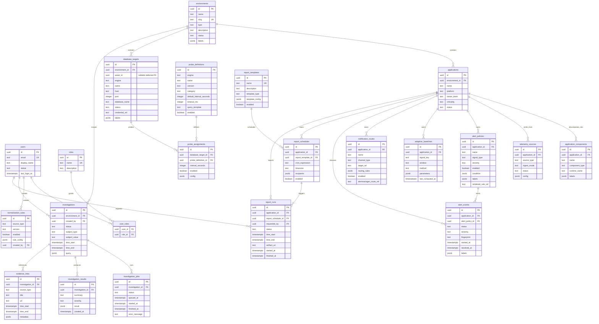
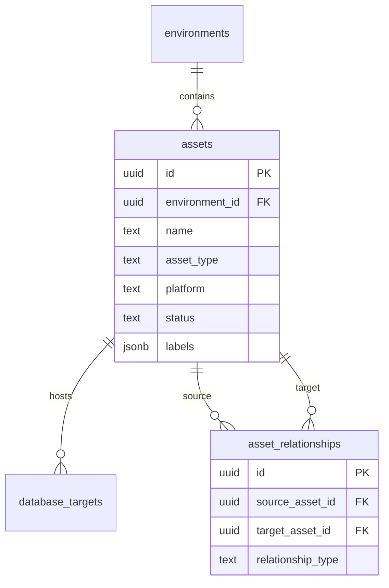

# Heartbeat Monitoring Platform Implementation Plan

> **For Hermes:** Use subagent-driven-development skill to implement this plan task-by-task.

**Goal:** Build Heartbeat, an SRE-focused monitoring platform that complements Dynatrace/Datadog by adding stronger database observability, end-to-end telemetry coverage, session-centric troubleshooting, adaptive alerting, and reporting.

**Architecture:** Start with an application-observability-first ingestion plane focused on OutSystems, a queryable telemetry store, a session-analysis workflow, and an operator-facing API/UI. Add SQL Server deep observability as the second major capability. Keep autonomous RCA out of MVP but design clean event/context pipelines so it can be added later.

**Tech Stack:** Go API/control plane and collectors, TypeScript/React web UI, PostgreSQL for product metadata, Prometheus for scraping/rules, Loki for logs, Grafana, Alertmanager, OpenTelemetry Collector, Redis for jobs/caching/ephemeral coordination, optional Mimir only if scale/retention require it, optional S3-compatible object storage for report artifacts, Kubernetes for deployment.

---

## 1. Goal and product scope

Heartbeat should fill gaps left by commercial APMs:
- Deep database observability beyond generic APM plugins
- Wait events, locks, memory pressure, connection/session saturation, storage pressure
- Cross-system telemetry for app/platform logs and metrics
- Session-centric issue discovery by application, user/IP, and time range; environment is derived from the application
- Flexible integrations instead of lock-in

### MVP outcomes
- OutSystems-first application observability
- OTLP metrics/log ingestion path
- session investigation workflow by application, user/IP, and time range
- Grafana integration for dashboards
- Loki-backed log exploration/search through Grafana
- Alerting w/ static rules + adaptive thresholds
- Scheduled operational reporting
- SQL Server deep observability as the second delivery priority

### Explicit non-goals for MVP
- Full multi-database engine parity
- Full APM-style code-level tracing agent ecosystem
- Autonomous root cause analysis
- Custom dashboarding engine if Grafana already satisfies the need

---

## 2. Current context / assumptions

- Repository is currently mostly empty: `README.md` and `Plan.md` exist.
- There is no established app/runtime structure yet.
- Product must complement, not replace, existing APMs.
- Database collectors must be safe for production use and use least-privilege credentials.
- OTel compatibility is required for future-proofing and ecosystem interoperability.
- Grafana and Loki are the go-to observability stack for MVP and default future direction; OpenSearch/Elastic is not part of the core architecture unless a future hard search requirement proves Loki insufficient.
- Alert quality matters more than alert count -> reduce false positives early.

---

## 3. Proposed high-level architecture

### 3.1 Core subsystems
1. **Control plane**
   - Manages environments, applications, telemetry sources, monitored database targets, rules, report schedules, and metadata
   - Does not own runtime integration/collector desired state in MVP; that comes from versioned YAML delivered through Kubernetes
2. **Collection plane**
   - DB collectors for engine-specific probes
   - OTLP ingestion for metrics/logs/traces where available
3. **Storage/query plane**
   - Time-series store for metrics
   - Search/index store for logs and session evidence
   - Relational metadata store for Heartbeat config/state
4. **Analysis plane**
   - Session correlation engine
   - Adaptive threshold engine
   - Report generation jobs
5. **Presentation plane**
   - API for UI/integrations
   - UI for SRE workflows
   - Grafana/Loki exports and deep links

### 3.2 Recommended MVP topology
- `apps/api` => REST API for control plane and investigation workflows
- `apps/web` => operator UI
- `services/otel-gateway` => OTLP gateway + OutSystems-first normalization pipeline
- `services/session-analyzer` => correlates logs/metrics/events for user/IP/time range
- `services/reporting` => scheduled report jobs and export generation
- `services/db-collector` => SQL Server metrics/waits/locks/session polling as second delivery priority
- `infra/` => docker-compose/k8s, Grafana, Loki, Prometheus, Alertmanager, storage wiring

### 3.3 Integration posture
- Prefer standards and pluggable adapters
- OTLP in, Prometheus out, Loki log export/search
- Grafana dashboard provisioning as code
- Avoid building custom charting/reporting primitives unless required

### 3.4 Core system decisions for MVP

These are the recommended default choices given the constraints:
- used inside a major company
- minimize dependencies and operational moving parts
- free to use in an enterprise environment

#### Programming languages
- **API / control plane:** Go
  - Reason: one backend language across product logic and collectors -> fewer runtimes, fewer frameworks, simpler deploys, good performance, easy static binaries
- **Web UI:** TypeScript + React
  - Reason: practical choice for internal operator UI; avoid unnecessary SSR complexity unless later required
- **Collectors / telemetry-heavy workers:** Go
  - Reason: best fit for concurrent polling, long-running services, low memory footprint, and strong telemetry tooling
- **Infra as code / packaging:** Helm + Kubernetes manifests

#### Databases / storage systems
- **System-of-record metadata DB:** PostgreSQL
  - Stores environments, minimal app/inventory metadata, monitored targets, users, alert policies, report schedules, and investigation/report metadata
  - Does not store integration config, audit logs, raw sessions, raw logs, or raw metrics in MVP
- **Metrics backend (MVP):** Prometheus
  - Reason: free, proven, Grafana-native, smallest dependency footprint for a serious MVP
- **Metrics backend (scale-up path):** Mimir
  - Introduce only if retention, HA, multi-tenancy, or cross-region scale outgrow Prometheus
- **Logs backend (MVP):** Loki
  - Reason: free, Grafana-native, materially fewer moving parts than OpenSearch/Elastic
- **Redis:** required in MVP
  - Used for background jobs, report generation queues, alert webhook/enrichment jobs, short-lived session-analysis caches, and lightweight distributed coordination
- **Report artifact storage:** S3-compatible object storage only if report persistence/export requires it in MVP
  - Otherwise generate reports on demand and store metadata in PostgreSQL

#### Core platform components
- **Telemetry ingress:** OpenTelemetry Collector
- **Dashboarding:** Grafana
- **Alert routing:** Alertmanager
- **Deployment target:** Kubernetes for staging/prod, Docker Compose for local dev
- **Auth for MVP:** local RBAC first, OIDC/SSO if corporate requirements demand it early

#### Why these revised choices
- **Go over NestJS for API:** fewer runtime layers and dependencies; better fit for an internal enterprise platform
- **Prometheus over VictoriaMetrics/Mimir for MVP:** smallest operational surface while staying Grafana-native
- **Mimir as later option, not day-1 dependency:** better for enterprise scale, but heavier to operate
- **Loki over OpenSearch for MVP:** keeps the stack coherent and much simpler to run
- **Redis kept in MVP:** justified because alerting, reporting, and session workflows are asynchronous enough to benefit from a dedicated queue/cache layer
- **PostgreSQL as the primary durable state store:** reliable, free, well understood in enterprise environments

#### Important tradeoff
- **Loki is the core/default log backend** for Heartbeat.
- OpenSearch/Elastic is not part of MVP or default future architecture.
- Reconsider OpenSearch/Elastic only if a validated future requirement needs rich document search that Loki cannot support without harmful label cardinality or query complexity.
- Clean recommendation:
  - **MVP and default path:** Grafana + Prometheus + Loki + PostgreSQL + Redis
  - **Scale path:** add Mimir only if Prometheus retention/HA/multi-tenancy requirements outgrow the MVP topology

### 3.5 Refined service architecture

#### A. API / control-plane service (`apps/api`)
Owns product-facing state and orchestration.

**Responsibilities**
- environment, application, and component management
- database target and probe policy onboarding
- telemetry source registration
- alert policy CRUD
- report schedule CRUD
- user/role/RBAC management
- investigation query APIs
- Grafana deep-link generation from YAML URL templates
- append-only audit event logging to files

**Internal modules**
- `auth`
- `users`
- `environments`
- `applications`
- `database_targets`
- `telemetry_sources`
- `investigations`
- `alerts`
- `reports`
- `integrations`
- `audit`

**Storage**
- PostgreSQL for durable data
- Redis for queues, ephemeral state, idempotency keys, and cached investigation summaries

#### B. OTel gateway and application normalizer (`services/otel-gateway`)
Owns ingestion and normalization of application telemetry, with OutSystems as the first supported platform.

**Responsibilities**
- receive OTLP metrics/logs
- ingest supported OutSystems logs/events/metrics
- parse source-specific payloads when required
- normalize labels and event fields
- forward logs to Loki
- expose or forward metrics to Prometheus-compatible ingestion path
- emit correlation hints for session analysis

**OutSystems-first normalization targets**
- application name/module
- environment
- tenant, when available
- user/session/request identifiers
- request path/action/screen/API operation
- error category/message/stack fingerprint
- latency/duration
- host/node/runtime metadata

**Rule**
- keep this service thin; do not rebuild the whole OTel Collector in app code
- use OpenTelemetry Collector config first, custom code second
- custom parsers must output the shared telemetry contract

#### C. DB collector service (`services/db-collector`)
Owns SQL Server probing and DB-specific normalization as the second delivery priority.

**Responsibilities**
- secure connection handling to SQL Server targets
- scheduled execution of approved probe sets
- query timeout/budget enforcement
- metric normalization into Prometheus-friendly series
- session/blocking snapshots for investigation evidence
- collector self-observability
- hot-reload collector runtime config from `config/integrations.yaml` via the shared config manager
- read target/probe metadata from API/PostgreSQL when SQL Server observability is enabled; YAML controls collector runtime groups, integration endpoints, and credential refs, not the full target catalog

**Key subcomponents**
- connector manager
- probe scheduler
- probe executors
- metric transformer
- evidence snapshot publisher
- health exporter

**Output**
- Prometheus scrape endpoint
- optional event payloads to Redis for downstream investigation/report jobs

#### D. Session analyzer (`services/session-analyzer`)
Owns investigation-time correlation logic.

**Responsibilities**
- accept investigation jobs from API
- fan out queries across PostgreSQL, Prometheus, Loki, and collector evidence
- correlate by application, derived environment, user, IP, service/component, host, and time range
- compute anomaly windows and likely bottleneck summaries
- cache short-lived results in Redis

**Outputs**
- investigation timeline
- evidence bundle
- links to Grafana dashboards/log views
- summarized incident narrative seeds for reporting/RCA later

#### E. Reporting service (`services/reporting`)
Owns scheduled and on-demand report generation.

**Responsibilities**
- consume schedules from API/DB
- enqueue and run report jobs via Redis
- gather metrics/log/investigation summaries
- render HTML/CSV/PDF outputs
- persist run metadata in PostgreSQL
- store artifacts in object storage when enabled

#### F. Web UI (`apps/web`)
Owns operator workflows.

**Primary screens**
- environments/applications
- DB targets onboarding
- SQL Server overview and drill-down entry points
- investigations
- alert policies
- reports
- integrations/admin

### 3.6 Data-flow architecture

#### Flow 1: OutSystems application observability
1. OutSystems emits logs/events/metrics through supported export path or OTLP-compatible bridge
2. OpenTelemetry Collector receives and routes data where possible
3. OTel gateway normalizes OutSystems-specific fields into Heartbeat telemetry contract
4. Logs land in Loki w/ controlled low-cardinality labels
5. Metrics land in Prometheus-compatible path
6. Session analyzer uses normalized identifiers for user/IP/session/time-range investigations
7. Grafana visualizes application health and links to Loki log views

#### Flow 2: Session investigation
1. User submits application + user/IP/session + time range in UI
2. API derives environment from the application and creates investigation record in PostgreSQL
3. API enqueues analysis job in Redis
4. Session analyzer pulls job
5. Analyzer queries Prometheus, Loki, collector evidence, and metadata DB
6. Analyzer stores short-lived summary/cache in Redis and durable result metadata in PostgreSQL
7. UI retrieves result and renders timeline + evidence links

#### Flow 3: Database observability
1. API stores SQL Server target/probe metadata in PostgreSQL when SQL Server observability is enabled
2. DB collector loads runtime collector config from YAML and target/probe metadata from the API/PostgreSQL
3. Collector probes SQL Server on schedule
4. Collector exposes normalized metrics
5. Prometheus scrapes collector
6. Grafana visualizes metrics
7. Alertmanager routes alert events from Prometheus rules

#### Flow 4: Reporting
1. Scheduler or user triggers report request
2. API/reporting service enqueues job in Redis
3. Reporting service gathers required metrics/logs/investigation summaries
4. Report output is generated and stored
5. UI/API exposes downloadable report and run status

### 3.7 Refined PostgreSQL persistence model

PostgreSQL is the durable system of record for product metadata. It stores environments, minimal app/inventory metadata, lifecycle state, investigation metadata, alert/report metadata, and monitored target metadata. It does **not** store raw metrics, raw logs, raw sessions, integration config, or audit log streams in MVP; those stay in Prometheus, Loki, YAML config, and append-only audit files as appropriate.

#### Schema conventions
- Primary keys: UUIDs
- Timestamps: `created_at`, `updated_at`, `deleted_at` for soft-delete where relevant
- Status fields: explicit enums/check constraints where practical
- Config fields: `jsonb` only for flexible integration/provider config, not for core relational data
- Secrets: store secret references only, not raw passwords/tokens
- Auditability: every operator/admin mutation should append a JSONL audit event to the configured audit log path

#### Terminology and examples

- `assets`
  - Meaning: concrete infrastructure/runtime things Heartbeat can point at, monitor, or relate to other infrastructure.
  - Fits here: VM, Windows server, Linux host, SQL Server instance host, IIS node, Kubernetes namespace, Redis instance, queue, gateway, load balancer.
  - Why PostgreSQL: this is metadata, not telemetry. It gives stable IDs for ownership, topology, database target placement, collector assignment, and human-readable investigation context.
  - MVP constraint: keep it minimal. If phase 1 only observes applications and not host/database topology, defer `asset_relationships` and optional app/component `asset_id` links.
  - Examples:
    - `name = prd-iis-01`, `asset_type = server`, `platform = windows`
    - `name = sql-prod-01`, `asset_type = database_server`, `platform = sqlserver`
    - `name = public-lb`, `asset_type = load_balancer`, `platform = nginx`

- `applications`
  - Meaning: business/application-level system operators care about.
  - Fits here: OutSystems app, customer portal, admin portal, payment service, batch processing app.
  - Examples:
    - `name = Claims Portal`, `platform = outsystems_traditional`, `criticality = high`
    - `name = Mobile API`, `platform = dotnet`, `criticality = medium`

- `application_components`
  - Meaning: pieces inside an application. A component may run on an asset, but it is not itself the infrastructure asset.
  - Fits here: OutSystems module, Reactive screen group, Traditional eSpace, background job, API endpoint group, worker, frontend, backend service.
  - Examples:
    - `application = Claims Portal`, `name = ClaimsWeb`, `component_type = outsystems_module`, `runtime_name = ClaimsWeb`
    - `application = Claims Portal`, `name = Login`, `component_type = screen_or_flow`
    - `application = Mobile API`, `name = auth-worker`, `component_type = worker`, `asset_id = prd-worker-02`
  - Rule: use `assets` for *where it runs*; use `application_components` for *what part of the app it is*.

- `telemetry_sources`
  - Meaning: a configured source/feed of telemetry for one application.
  - Fits here: OutSystems log export for Claims Portal, OTLP receiver for Mobile API, Prometheus scrape source for one app, Loki label selector config for one app.
  - Examples:
    - `application = Claims Portal`, `source_type = outsystems`, `ingest_mode = loki_query`, `config = {"log_labels":{"app":"Claims"}}`
    - `application = Mobile API`, `source_type = otel`, `ingest_mode = otlp`, `config = {"service_name":"mobile-api"}`
  - Rule: no direct `environment_id` on `telemetry_sources` in MVP. The environment is derived through `telemetry_sources.application_id -> applications.environment_id`. This avoids duplicate ownership paths while still supporting multiple apps per environment, each w/ different sources.

- `outsystems_sources`
  - MVP decision: do **not** create this as a physical table initially.
  - Reasoning: OutSystems is an application platform/source type, not a separate domain object parallel to `applications`. Creating `outsystems_sources` too early risks duplicating application identity.
  - MVP placement: OutSystems-specific source settings live in `telemetry_sources.config`, with `applications.platform` and `application_components.component_type` carrying the app/component model.
  - Future-only reason to add it: if OutSystems needs many queryable/validated fields, constraints, migrations, or UI workflows that become awkward inside `telemetry_sources.config`.
  - Future examples if promoted later: `environment_key`, `application_key`, `tenant_key`, `log_format_version`, `module_mapping_strategy`.

- `normalization_rules`
  - Meaning: versioned parsing/mapping rules that convert source-specific telemetry fields into Heartbeat's normalized labels and fields.
  - Fits here: mapping OutSystems `SessionId` -> `session.id`, `UserId` -> `enduser.id`, module/action fields -> normalized component/action fields, IP extraction logic.
  - Examples:
    - `source_type = outsystems`, `version = default-log-v1`, `rule_config = {"session_field":"SessionId","user_field":"UserId"}`
    - `source_type = otel`, `version = semantic-conventions-v1`, `rule_config = {"service_field":"service.name"}`
  - Rule: rules are source-type/version scoped, not environment-owned.

- Session identity mappings
  - MVP decision: do **not** store session/user correlation mappings in PostgreSQL.
  - Reasoning: sessions are telemetry-derived, high-volume, potentially sensitive, and better reconstructed from Loki logs/metrics during investigation.
  - Use PostgreSQL only for the investigation request/result metadata; use Loki/Prometheus for session evidence and correlation.

#### Data ownership boundary
- **PostgreSQL:** product metadata, application inventory, investigation requests/results, report metadata, alert policy metadata, and alert event history
- **Prometheus:** raw/derived metrics, recording rules, and live metric alert evaluation
- **Loki:** raw/normalized logs and LogQL investigation queries
- **Alertmanager:** alert grouping, deduplication, routing, silencing, and notification delivery
- **Redis:** queues, short-lived caches, idempotency keys, worker locks, and transient processing state
- **YAML config files:** deployment-owned integration endpoints, dashboard URL templates, and runtime collector desired state
- **Append-only log files:** audit events in JSONL format for MVP
- **Object storage / filesystem:** report artifacts when persistence is needed

Rules:
- PostgreSQL must not store raw OutSystems metrics.
- PostgreSQL must not store raw logs.
- PostgreSQL must not perform live alert evaluation.
- PostgreSQL must not store report binaries.
- Heartbeat can store alert definitions in PostgreSQL, but executable rules are rendered to Prometheus/Alertmanager configuration or APIs.

#### Identity and access
- `users`
  - `id`, `email`, `display_name`, `status`, `last_login_at`
- `roles`
  - `id`, `name`, `description`
- `user_roles`
  - `user_id`, `role_id`

#### Environment and inventory
- `environments`
  - `id`, `name`, `slug`, `type`, `description`, `status`, `labels jsonb`
- `applications`
  - `id`, `environment_id`, `name`, `platform`, `owner_team`, `criticality`, `status`
- `application_components`
  - `id`, `application_id`, `name`, `component_type`, `runtime_name`, `labels jsonb`
- `telemetry_sources`
  - `id`, `application_id`, `source_type`, `ingest_mode`, `status`, `config jsonb`
- `normalization_rules`
  - `id`, `source_type`, `version`, `enabled`, `rule_config jsonb`, `created_by`
- Deferred until SQL Server/host topology is in scope:
  - `assets`: `id`, `environment_id`, `name`, `asset_type`, `platform`, `status`, `labels jsonb`
  - `asset_relationships`: `id`, `source_asset_id`, `target_asset_id`, `relationship_type`
  - `applications.primary_asset_id`
  - `application_components.asset_id`

#### Database observability / SQL Server second priority
- `database_targets`
  - `id`, `environment_id`, `asset_id nullable`, `engine`, `name`, `host`, `port`, `database_name nullable`, `status`, `credential_ref`, `labels jsonb`
- `probe_definitions`
  - `id`, `engine`, `name`, `version`, `category`, `default_interval_seconds`, `timeout_ms`, `query_template`, `enabled`
- `probe_assignments`
  - `id`, `database_target_id`, `probe_definition_id`, `interval_seconds`, `enabled`, `config jsonb`
- Not stored in PostgreSQL for MVP:
  - collector desired state, collector groups, integration endpoints, and runtime add/remove config live in YAML/Kubernetes
  - collector runtime state should be exposed through `/metrics`, `/healthz`, `/readyz`, and logs first; add PostgreSQL runtime tables only if the UI needs historical fleet inventory

#### Investigations and evidence
- `investigations`
  - `id`, `environment_id`, `created_by`, `status`, `subject_type`, `subject_value`, `time_start`, `time_end`, `query jsonb`
- `investigation_jobs`
  - `id`, `investigation_id`, `status`, `queued_at`, `started_at`, `finished_at`, `error_message nullable`
- `investigation_results`
  - `id`, `investigation_id`, `summary`, `severity`, `result jsonb`, `created_at`
- `evidence_links`
  - `id`, `investigation_id`, `source_type`, `title`, `url`, `time_start`, `time_end`, `metadata jsonb`

#### Alerting
- `alert_policies`
  - `id`, `application_id`, `name`, `signal_type`, `severity`, `enabled`, `condition jsonb`, `labels jsonb`, `rendered_rule_ref nullable`
- `adaptive_baselines`
  - `id`, `application_id`, `signal_key`, `window`, `method`, `parameters jsonb`, `last_computed_at`
- `notification_routes`
  - `id`, `application_id`, `name`, `channel_type`, `target_ref`, `routing_rules jsonb`, `enabled`, `alertmanager_route_ref nullable`
- `alert_events`
  - `id`, `application_id`, `alert_policy_id nullable`, `status`, `severity`, `fingerprint`, `started_at`, `resolved_at nullable`, `labels jsonb`

#### Reporting
- `report_templates`
  - `id`, `name`, `description`, `template_type`, `template_config jsonb`, `enabled`
- `report_schedules`
  - `id`, `application_id`, `report_template_id`, `cron_expression`, `timezone`, `recipients jsonb`, `enabled`
- `report_runs`
  - `id`, `application_id`, `report_schedule_id nullable`, `requested_by nullable`, `status`, `time_start`, `time_end`, `artifact_uri nullable`, `started_at`, `finished_at`

#### Integrations and audit
- No PostgreSQL tables for integrations/audit in MVP.
- Integration endpoints and Grafana URL templates live in versioned YAML config files.
- Audit events are written as append-only JSONL files.

#### Recommended indexes
- `environments(slug)` unique
- `applications(environment_id, name)`
- `telemetry_sources(application_id, source_type, status)`
- `database_targets(environment_id, engine, status)`
- `investigations(environment_id, created_at desc)`
- `investigations(environment_id, subject_type, subject_value, time_start, time_end)`
- `alert_events(application_id, fingerprint, started_at desc)`
- Deferred w/ asset tables: `assets(environment_id, asset_type)`

#### PostgreSQL ER diagram

This is the authoritative PostgreSQL model for the current plan. It intentionally excludes integration config, Grafana link templates, audit streams, raw telemetry, raw logs, raw sessions, and report binaries.



Deferred topology extension, only when SQL Server/host topology is in scope:



#### Exact ER relationships

This is the authoritative MVP relationship model. Keep it simple; avoid redundant joins unless a real workflow requires them.

##### Identity and access
- `users.id` 1 -> N `user_roles.user_id`
  - FK: `user_roles.user_id -> users.id`
  - Required: yes
  - Delete behavior: restrict user deletion if audit/history exists; prefer `users.status = disabled`
- `roles.id` 1 -> N `user_roles.role_id`
  - FK: `user_roles.role_id -> roles.id`
  - Required: yes
  - Delete behavior: restrict
- Unique constraints:
  - `users.email` unique
  - `roles.name` unique
  - `user_roles(user_id, role_id)` unique

##### Environment and inventory
- `environments.id` 1 -> N `applications.environment_id`
  - FK: `applications.environment_id -> environments.id`
  - Required: yes
  - Delete behavior: restrict if applications exist
- `applications.id` 1 -> N `application_components.application_id`
  - FK: `application_components.application_id -> applications.id`
  - Required: yes
  - Delete behavior: cascade only on hard-delete; prefer soft-delete/status changes
- Deferred asset/topology relationships for SQL Server/host observability slice:
  - `environments.id` 1 -> N `assets.environment_id`
  - `assets.id` 1 -> N `applications.primary_asset_id`
  - `assets.id` 1 -> N `application_components.asset_id`
  - `assets.id` N -> N `assets.id` through `asset_relationships`
- Unique constraints:
  - `environments.slug` unique
  - `applications(environment_id, name)` unique
  - `application_components(application_id, name, component_type)` unique
  - deferred w/ asset tables: `assets(environment_id, name)` unique
  - deferred w/ asset tables: `asset_relationships(source_asset_id, target_asset_id, relationship_type)` unique
- Explicit non-relationships:
  - no `environment -> environment` relation in MVP
  - no `environment_assets` join table
  - no direct `application -> database_target` relation in MVP

##### Telemetry source and OutSystems
- `applications.id` 1 -> N `telemetry_sources.application_id`
  - FK: `telemetry_sources.application_id -> applications.id`
  - Required: yes
  - Delete behavior: restrict if active; cascade only through intentional application hard-delete cleanup
- `users.id` 1 -> N `normalization_rules.created_by`
  - FK: `normalization_rules.created_by -> users.id`
  - Required: no for system-created rules
  - Delete behavior: set null
- Unique constraints:
  - `telemetry_sources(application_id, source_type, ingest_mode)` partial/conditional as needed
  - `normalization_rules(source_type, version)` unique
- Notes:
  - OutSystems Traditional and Reactive should be represented through `applications.platform`, `application_components.component_type`, and `telemetry_sources.config` only where necessary.
  - Do not create `outsystems_sources` in the MVP unless OutSystems-specific config becomes large, queryable, or constraint-heavy enough to justify a source-specific extension table.
  - Keep default OutSystems log field compatibility before adding improved mappings.

##### SQL Server collector
- `environments.id` 1 -> N `database_targets.environment_id`
  - FK: `database_targets.environment_id -> environments.id`
  - Required: yes
  - Delete behavior: restrict if probe assignments/history exist
- `assets.id` 1 -> N `database_targets.asset_id`
  - FK: `database_targets.asset_id -> assets.id`
  - Required: no
  - Delete behavior: set null
  - Deferred: only active when asset/topology extension is enabled
- `database_targets.id` 1 -> N `probe_assignments.database_target_id`
  - FK: `probe_assignments.database_target_id -> database_targets.id`
  - Required: yes
  - Delete behavior: cascade assignment rows only
- `probe_definitions.id` 1 -> N `probe_assignments.probe_definition_id`
  - FK: `probe_assignments.probe_definition_id -> probe_definitions.id`
  - Required: yes
  - Delete behavior: restrict; disable/version probes instead of deleting
- Unique constraints:
  - `database_targets(environment_id, engine, host, port, database_name)` unique
  - `probe_definitions(engine, name, version)` unique
  - `probe_assignments(database_target_id, probe_definition_id)` unique
- Notes:
  - Collector desired state, grouping, scaling, and runtime add/remove are controlled by YAML/Kubernetes, not PostgreSQL assignment tables.
  - If the UI later needs collector fleet history, add observed runtime tables separately; do not mix desired runtime config into target/probe metadata.
- Safety invariant:
  - SQL Server probe definitions must be reviewed for non-blocking behavior before assignment to production targets.

##### Investigations and evidence
- `environments.id` 1 -> N `investigations.environment_id`
  - FK: `investigations.environment_id -> environments.id`
  - Required: yes
  - Delete behavior: restrict; retain investigation history according to policy
- `users.id` 1 -> N `investigations.created_by`
  - FK: `investigations.created_by -> users.id`
  - Required: yes for user-created investigations; system user can be used for automation
  - Delete behavior: restrict or set to retained system/deleted user marker
- `investigations.id` 1 -> N `investigation_jobs.investigation_id`
  - FK: `investigation_jobs.investigation_id -> investigations.id`
  - Required: yes
  - Delete behavior: cascade only if investigation is hard-deleted by retention job
- `investigations.id` 1 -> N `investigation_results.investigation_id`
  - FK: `investigation_results.investigation_id -> investigations.id`
  - Required: yes
  - Delete behavior: cascade only by retention job
- `investigations.id` 1 -> N `evidence_links.investigation_id`
  - FK: `evidence_links.investigation_id -> investigations.id`
  - Required: yes
  - Delete behavior: cascade only by retention job
- Unique constraints:
  - optional `investigation_jobs(investigation_id, status)` partial unique for one active job per investigation
- Notes:
  - `investigations.subject_type` should start with `user`, `ip`, `session`, `request`.
  - `evidence_links` points to Grafana/Loki/Prometheus views; it does not store raw evidence payloads.

##### Alerting
- `applications.id` 1 -> N `alert_policies.application_id`
  - FK: `alert_policies.application_id -> applications.id`
  - Required: yes
  - Delete behavior: restrict; disable policies instead of deleting
- `applications.id` 1 -> N `adaptive_baselines.application_id`
  - FK: `adaptive_baselines.application_id -> applications.id`
  - Required: yes
  - Delete behavior: cascade only through retention/config cleanup
- `applications.id` 1 -> N `notification_routes.application_id`
  - FK: `notification_routes.application_id -> applications.id`
  - Required: yes
  - Delete behavior: restrict if referenced by active policies/config
- `applications.id` 1 -> N `alert_events.application_id`
  - FK: `alert_events.application_id -> applications.id`
  - Required: yes
  - Delete behavior: retention-based cleanup
- `alert_policies.id` 1 -> N `alert_events.alert_policy_id`
  - FK: `alert_events.alert_policy_id -> alert_policies.id`
  - Required: no; external/unmapped Alertmanager events may exist
  - Delete behavior: set null or restrict; prefer policy disablement
- Unique constraints:
  - `alert_policies(application_id, name)` unique
  - `adaptive_baselines(application_id, signal_key, window, method)` unique
  - `notification_routes(application_id, name)` unique
  - `alert_events(application_id, fingerprint, started_at)` unique
- Notes:
  - Alerting is application-owned in MVP. Environment context is derived through `applications.environment_id`.
  - PostgreSQL stores policy intent and alert event metadata only.
  - Prometheus evaluates; Alertmanager routes/dedupes/delivers.

##### Reporting
- `report_templates.id` 1 -> N `report_schedules.report_template_id`
  - FK: `report_schedules.report_template_id -> report_templates.id`
  - Required: yes
  - Delete behavior: restrict if schedules exist; disable templates instead
- `applications.id` 1 -> N `report_schedules.application_id`
  - FK: `report_schedules.application_id -> applications.id`
  - Required: yes
  - Delete behavior: restrict
- `applications.id` 1 -> N `report_runs.application_id`
  - FK: `report_runs.application_id -> applications.id`
  - Required: yes
  - Delete behavior: restrict while report history is retained
- `report_schedules.id` 1 -> N `report_runs.report_schedule_id`
  - FK: `report_runs.report_schedule_id -> report_schedules.id`
  - Required: no; on-demand report runs may not have a schedule
  - Delete behavior: set null or restrict based on retention policy
- `users.id` 1 -> N `report_runs.requested_by`
  - FK: `report_runs.requested_by -> users.id`
  - Required: no; scheduled/system reports may not have a requester
  - Delete behavior: set null
- Unique constraints:
  - `report_templates(name)` unique
  - `report_schedules(application_id, report_template_id, cron_expression, timezone)` unique
- Notes:
  - Reporting is application-owned in MVP. Environment-level summaries can be generated later by aggregating application reports.
  - `report_runs.artifact_uri` is a pointer only.
  - Report artifacts may be deleted after confirmed delivery; keep only run metadata if no retention is required.

##### Integrations, runtime collectors, and audit
- No PostgreSQL ER relationships for integration config in MVP.
- `config/integrations.yaml` owns integration endpoint metadata, credential references, dashboard URL templates, and collector definitions.
- Runtime add/remove is supported by hot-reloading the YAML file, not by storing integration config in PostgreSQL.
- Services load config through a shared config manager that validates the YAML, computes a config version/hash, and atomically swaps the active collector set.
- Collector lifecycle is derived from config diff:
  - new collector in YAML -> validate -> start/register collector
  - removed collector from YAML -> graceful drain -> unregister/stop collector
  - changed collector config -> validate -> restart or live-update that collector depending on connector support
- Reload triggers:
  - filesystem watch for local/dev
  - explicit `SIGHUP` or `/admin/config/reload` endpoint for production
  - Kubernetes ConfigMap/Secret projected-volume update or rollout-compatible reload sidecar if deployed on K8s
- Keep collector runtime state in `/metrics`, `/healthz`, `/readyz`, and logs for MVP; add PostgreSQL fleet tables only if later UI/history workflows need them.
- Audit events are append-only JSONL files under a configured audit directory.
- Future PostgreSQL audit/config tables are only justified if the product needs UI-driven integration CRUD, relational audit search, or DB-backed compliance exports.

#### PostgreSQL topic review

##### Identity and access
Purpose: control the minimal wallboard/admin access needed for MVP.

Review:
- Keep auth intentionally simple for phase 1: one shared SRE/admin-style user is acceptable.
- `users`, `roles`, and `user_roles` are enough for MVP.
- Do not add permissions, SSO-specific tables, or environment-scoped RBAC yet.
- Keep the schema easy to extend later if named users or SSO become necessary.

Risk:
- Do not let a temporary shared-user model leak into long-term enterprise design. Treat it as an MVP shortcut.

##### Environment and inventory
Purpose: define the clean ownership tree for everything Heartbeat monitors.

Review:
- `environment` is the top boundary. Everything observable belongs to exactly one environment.
- `application` belongs to one `environment`.
- `application_component` belongs to one `application`.
- `asset` is deferred unless SQL Server/host topology is part of the active MVP slice. If enabled, assets represent concrete runtime/infrastructure/database nodes, not telemetry.
- `asset_relationships` is deferred w/ assets and is only for asset-to-asset dependency links such as app server -> database, gateway -> backend, worker -> queue.

Canonical MVP relationships:
- `environment` 1 -> N `applications`
- `application` 1 -> N `application_components`

Deferred topology relationships:
- `environment` 1 -> N `assets`
- `application_component` N -> 1 `asset` optional
- `asset` N -> N `asset` through `asset_relationships`

MVP decision:
- Keep `assets` only if SQL Server/host topology work is in scope for the same MVP slice.
- If the first slice is strictly OutSystems/application observability, defer `assets`, `asset_relationships`, `applications.primary_asset_id`, and `application_components.asset_id` until DB/host topology is needed.
- The argument for keeping assets in PostgreSQL is that they are stable inventory metadata used for ownership and collector targeting, not raw telemetry.

Rules to avoid redundancy:
- no `environment -> environment` relationship table for MVP
- no direct `environment_assets` join table; `assets.environment_id` is enough
- no direct `application -> database_target` relation unless a real workflow requires it later
- no duplicate ownership paths; ownership should be inferable from foreign keys

Risk:
- Asset modeling can become a CMDB. Keep only what Heartbeat needs for observability and investigation.

##### Application observability / OutSystems-first
Purpose: make OutSystems the first-class phase-1 platform without making it a separate domain object parallel to applications.

Review:
- `applications` and `application_components` represent business apps, modules, services, screens/actions, or runtime components.
- `telemetry_sources` is generic and application-owned so future platforms fit without schema churn.
- Do not create `outsystems_sources` in MVP. Put OutSystems-specific source configuration in `telemetry_sources.config` unless it grows into queryable/validated relational data.
- OutSystems ingestion should follow the default OutSystems log pattern first so existing SRE troubleshooting queries remain reusable.
- The model must support both **Traditional** and **Reactive** OutSystems instances from the start.
- `normalization_rules` lets parsers evolve by source type/version, but phase 1 should begin w/ faithful normalization rather than aggressive reinterpretation.
- Session/user correlation is reconstructed from Loki/Prometheus during investigations; do not persist session identity mappings in PostgreSQL for MVP.

Risk:
- Session correlation depends on consistent source fields and normalization. Validate the default OutSystems log fields early.
- Avoid storing PII unnecessarily; prefer hashed/normalized values in logs where possible.
- If we identify improvements over the default OutSystems pattern, confirm before implementing them so we do not break current operational workflows.

##### Database observability / SQL Server second priority
Purpose: prepare the DB collector domain without making it phase-1 blocker.

Review:
- `database_targets` stores DB endpoint metadata and secret references.
- Runtime collector groups/add-remove config live in `config/integrations.yaml` and Kubernetes, not PostgreSQL.
- Collector target selection should read `database_targets`/`probe_assignments` from API/PostgreSQL when SQL Server observability is enabled.
- `probe_definitions` versions safe SQL probes.
- `probe_assignments` allows per-target enablement and intervals.
- All production extraction access must use **non-blocking transactions** and query patterns that do not interfere with workload execution.
- This matters especially for extraction queues and recurring production reads.

Risk:
- Never store raw DB credentials.
- Probe definitions need review/versioning because unsafe SQL can hurt production DBs.
- Blocking reads on production are unacceptable; collector queries must be explicitly designed and reviewed for non-blocking behavior.

##### Investigations and evidence
Purpose: persist investigation lifecycle and durable summaries while raw data remains in Prometheus/Loki.

Review:
- `investigations` stores the query intent: subject, environment, time range, and filters.
- `investigation_jobs` tracks async execution through Redis-backed workers.
- `investigation_results` stores durable summary output, not raw logs/metrics.
- `evidence_links` points to Grafana/Loki/Prometheus views and specific time windows.

Risk:
- Do not duplicate raw telemetry into PostgreSQL.
- Keep result JSON bounded; large evidence payloads belong in object storage or generated views.

##### Alerting
Purpose: store application-owned alert configuration and alert history while Prometheus/Alertmanager remain the live alerting plane.

Review:
- `alert_policies` stores UI-managed policy intent and metadata for one application. These policies are rendered into Prometheus-compatible rules; PostgreSQL does not evaluate them live.
- `adaptive_baselines` stores per-application computed threshold parameters that rule generation or analysis jobs can use.
- `notification_routes` stores per-application route intent and references to Alertmanager routes; Alertmanager performs grouping, dedupe, silence, and delivery.
- `alert_events` records application-scoped lifecycle/fingerprint from Alertmanager/webhook events for audit, dedupe, reporting, and investigation context.
- Environment context is derived from `application.environment_id`; do not duplicate `environment_id` in alert tables for MVP.

Risk:
- Avoid splitting alert truth across too many systems. Prometheus evaluates alerts, Alertmanager routes alerts, PostgreSQL tracks product-owned intent/history.
- Do not build a second alert engine in PostgreSQL.

##### Reporting
Purpose: schedule, run, and audit generated operational reports for one application.

Review:
- `report_templates` defines report structure.
- `report_schedules` defines cadence, timezone, recipients, and application.
- `report_runs` records executions, application, requester, and artifact references.
- PostgreSQL should store report metadata and delivery state only.
- Report artifacts may be deleted after confirmed delivery if retention is not required.
- Environment-level reporting can be added later as aggregation across applications in the same environment.

Risk:
- Report artifacts should not live as large blobs or binaries in PostgreSQL. Store URI/reference only.

##### Integrations, runtime collectors, and audit
Purpose: keep deployment-owned integrations simple while still allowing collector add/remove at runtime through validated YAML hot-reload.

Review:
- Use YAML config files for integrations in MVP.
  - Primary file: `config/integrations.yaml`
  - Contents: Grafana base URL, Loki endpoint, Alertmanager endpoint, SMTP/webhook provider, credential references, Grafana URL templates, and collector definitions.
  - Store secret references only; raw secrets stay in the secret manager or environment-specific secret files.
- Runtime add/remove works by reloading YAML and diffing desired collector config vs currently running collectors.
  - Add: new YAML collector entry -> validate -> instantiate/start/register collector.
  - Remove: deleted YAML collector entry -> graceful drain -> unregister/stop collector.
  - Change: modified YAML collector entry -> validate -> live-update if supported, otherwise restart that collector only.
- Implement a shared config manager.
  - Parse and schema-validate YAML before applying anything.
  - Compute `config_version` / hash.
  - Apply changes atomically: invalid config keeps the previous active config.
  - Expose current config version and reload status via health/admin endpoint.
- Kubernetes/Go reload strategy:
  - Treat YAML as desired state delivered by Kubernetes `ConfigMap` plus secret references, not raw secrets.
  - Mount config as a projected volume, but do not rely on watching the file itself; Kubernetes updates ConfigMap volumes through symlink swaps, so watch the parent directory and debounce events.
  - Support explicit `SIGHUP` and authenticated `/admin/config/reload` as deterministic production reload triggers.
  - Prefer an off-the-shelf reload sidecar/controller for production rollout signaling if needed, e.g. checksum-annotation rollout or reloader sidecar that calls `/admin/config/reload`; do not build a fragile custom Kubernetes watcher first.
  - In Go, implement a small config manager around typed structs, YAML decoding, schema/business validation, config hashing, and `atomic.Value`/copy-on-write snapshots.
  - Never mutate active config in place. Build a candidate config, validate all dependencies, compute the diff, then swap active config only after successful collector reconciliation.
  - Collector manager owns lifecycle: `Start(ctx, cfg)`, `Update(ctx, cfg)` when safe, `Drain(ctx)`, `Stop(ctx)`.
  - Expose `/healthz`, `/readyz`, `/admin/config`, and `/metrics` with current `config_version`, last reload timestamp, last reload result, and per-collector state.
- Do not create a `grafana_links` PostgreSQL table in MVP.
  - Prefer deterministic Grafana URLs from templates and variables in YAML.
  - Add a table only if operators need editable per-app/per-panel dashboard mappings from the UI.
- Use append-only audit log files in MVP, preferably JSONL.
  - Example file pattern: `audit/heartbeat-audit-YYYY-MM-DD.jsonl`
  - Each line: timestamp, actor, action, entity_type, entity_id, before/after metadata, request_id, config_version.
  - Log config reload success/failure and collector add/remove/change decisions.
- PostgreSQL audit/config tables become useful later if we need UI CRUD, relational audit search, compliance exports, or multi-tenant admin workflows.

Example `config/integrations.yaml` shape:

```yaml
version: 1
integrations:
  grafana:
    base_url: https://grafana.example.com
    dashboard_templates:
      app_health: /d/app-health?var-env=${environment.slug}&var-app=${application.name}
  loki:
    endpoint: https://loki.example.com
    credential_ref: secret://heartbeat/loki
  alertmanager:
    endpoint: https://alertmanager.example.com
    credential_ref: secret://heartbeat/alertmanager
collectors:
  - id: outsystems-claims-logs
    type: outsystems_logs
    enabled: true
    application: claims-portal
    source:
      mode: loki_query
      labels:
        app: Claims
    normalization_rule: outsystems-default-log-v1
  - id: sql-prod-main
    type: sqlserver
    enabled: true
    environment: prd
    target:
      host: sql-prod-01
      port: 1433
      database: Claims
      credential_ref: secret://heartbeat/sql-prod-main
    probes:
      - waits
      - sessions
```

Risk:
- Hot reload must be conservative: invalid YAML, missing secrets, duplicate collector IDs, or unsafe collector changes must fail closed and keep the previous active config.
- Kubernetes ConfigMap updates are eventually reflected in mounted volumes and use symlink replacement semantics. File watchers must watch the directory and debounce, or production should use explicit reload signaling.
- Runtime config files can drift from Git if edited manually on servers. Prefer GitOps or controlled deployment path even though the running service can hot-reload.
- Reloads must be observable. Alert on repeated reload failures, stale config versions, collector crash loops, and collectors stuck draining.
- File audit logs need rotation, retention, and shipping; otherwise they become hard to query.
- Audit should store metadata diffs and secret references only; never raw credentials/tokens.

Next implementation steps:
1. Convert the PostgreSQL ER diagram into explicit migrations and constraints.
   - Create migration files for core tables: users/roles, environments/applications/components, telemetry sources, normalization rules, investigations/evidence, alerting, reporting.
   - Keep assets/topology, integrations, Grafana links, sessions, and audit streams out of PostgreSQL for MVP unless separately approved.
2. Add database-level safety constraints.
   - Unique indexes listed above.
   - FK delete behavior matching the ER relationship section.
   - Check constraints for status/severity/type enums where practical.
   - JSONB shape validation only where stable enough; avoid over-constraining early config blobs.
3. Add schema tests/verification.
   - Migration up/down smoke test.
   - FK/unique constraint tests.
   - Query-plan checks for first investigation, alert, and reporting lookups.
4. Define `config/integrations.yaml` schema and sample fixtures.
5. Create Go config package, likely `internal/config`, with typed structs, YAML decoder, validation, hashing, and redacted rendering.
6. Create Go collector lifecycle interface, likely `internal/collectors`, with `Start`, `Update`, `Drain`, `Stop`, `Status`.
7. Create config reconciliation loop that diffs desired collectors by stable `id` and applies add/remove/change operations w/ rollback/fail-closed behavior.
8. Add reload triggers: `SIGHUP`, authenticated `POST /admin/config/reload`, and optional fsnotify parent-directory watcher for dev/local.
9. Add Kubernetes manifests: ConfigMap for YAML, Secrets or external-secret refs for credentials, projected volume mount, probes, metrics scrape config, and optional reloader sidecar/controller.
10. Add config/reload tests: valid/invalid YAML, duplicate IDs, missing secret refs, config hash stability, atomic swap behavior, collector add/remove/change diffing, failed reload keeps previous active config, K8s-style symlink swap watcher behavior if fsnotify is enabled.

##### Indexing strategy
Purpose: keep the first workflows fast.

Review:
- Index environment-scoped lookups first.
- Prioritize investigation queries by subject + time range.
- Prioritize audit lookups by entity + timestamp.
- Add more indexes from query plans, not guesses.

Risk:
- Too many early indexes slow writes and migrations. Start with the listed indexes only.

#### Redis data classes
- job queues: `report:*`, `investigation:*`, `alert:*`
- short TTL caches for expensive investigation results
- distributed locks for singleton schedulers/workers
- idempotency keys for retried jobs
- rate-limit counters for expensive operations

#### Observability backends
- **Prometheus:** metrics and recording rules
- **Loki:** logs and derived log queries
- **Grafana:** dashboards, exploration, and alert entry links

### 3.8 Architectural guardrails
- Do not let the API service query SQL Server directly -> all DB-specific collection stays in `db-collector`
- Do not make Redis the system of record -> durable truth stays in PostgreSQL
- Store durable job/request state in PostgreSQL and use Redis for dispatch, locks, retry coordination, and short-lived caches only
- Do not over-label Loki streams -> keep label cardinality controlled; place high-cardinality fields in log payload/body
- Do not put adaptive alert math inside Grafana dashboards -> compute/version baselines in services and render executable rules to Prometheus
- Do not let custom parsers bypass the shared telemetry contract -> normalization must be centralized
- Do not duplicate ownership paths: app-owned children derive environment through `applications.environment_id`
- Do not put runtime collector desired state in PostgreSQL for MVP; YAML/Kubernetes is the desired-state source, metrics/logs expose runtime state

### 3.9 Pre-implementation review findings and refinements

Concerns found and resolved before implementation:

1. **Environment vs application ownership drift**
   - Earlier wording mixed environment-scoped session searches, telemetry sources, alerts, and reports.
   - Refined rule: application-owned workflows use `application_id`; environment is derived from the application.
   - Environment remains useful for grouping, database targets, and coarse filtering.

2. **Assets were leaking back into the MVP**
   - Earlier service/UI wording implied first-class asset management even though assets are deferred.
   - Refined rule: phase-1 UI/API focuses on environments, applications, components, telemetry sources, investigations, alerts, and reports.
   - Assets/topology are introduced only when SQL Server/host topology needs them.

3. **Collector runtime state conflicted with YAML hot-reload**
   - Earlier ER included `collector_instances` and `collector_assignments`, which conflicts with YAML/Kubernetes as desired runtime state.
   - Refined rule: PostgreSQL stores database targets and probe policies; YAML/Kubernetes stores collector runtime groups/add-remove config.
   - Collector health/status is exposed via `/metrics`, `/healthz`, `/readyz`, and logs first. Add DB fleet tables only if product UI needs historical collector inventory.

4. **Go project layout should follow Go conventions**
   - Avoid Node-style `src/modules` as the real backend layout.
   - Use `cmd/<service>/main.go`, `internal/<domain>/`, and `pkg/` only for intentionally shared libraries.
   - Existing task paths that say `src/modules` are conceptual; implementation should use idiomatic Go packages.

5. **OTel gateway should not become a second OTel Collector**
   - Use stock OpenTelemetry Collector config and processors first.
   - Custom Go code is justified only for OutSystems-specific parsing/normalization that cannot be cleanly expressed in collector config.
   - Any custom parser must output the shared Heartbeat telemetry contract.

6. **Redis durability boundary needed tightening**
   - Redis is acceptable for queues, locks, and caches.
   - Durable job state belongs in PostgreSQL tables like `investigation_jobs` and `report_runs`; workers should be idempotent and recover from Redis/job retries.

7. **Kubernetes config reload needs explicit production semantics**
   - ConfigMap projected volumes use symlink swap behavior and eventually-consistent update timing.
   - Production should support explicit `SIGHUP` or authenticated `/admin/config/reload`; fsnotify is optional/dev-friendly and must watch the parent directory with debounce.

---

## 4. Recommended repo layout

Create the project as a monorepo so shared schemas and deployment assets stay aligned.

```text
projects/LifeLine/Heartbeat/
  README.md
  docs/
    architecture/
      overview.md
      database-observability.md
      session-analysis.md
      alerting.md
    product/
      requirements.md
      phased-roadmap.md
    runbooks/
      local-dev.md
      sqlserver-onboarding.md
      alert-tuning.md
  apps/
    api/
      cmd/api/
      internal/
        auth/
        users/
        environments/
        applications/
        telemetrysources/
        databasetargets/
        investigations/
        alerts/
        reports/
        audit/
    web/
  services/
    db-collector/
      cmd/db-collector/
      internal/
        config/
        collectors/
        connectors/sqlserver/
        probes/sqlserver/
        export/
    otel-gateway/
      cmd/otel-gateway/
      internal/
        normalization/
        parsers/outsystems/
    session-analyzer/
      cmd/session-analyzer/
      internal/
        analysis/
        evidence/
    reporting/
      cmd/reporting/
      internal/
        templates/
        jobs/
  packages/
    config-schema/
    telemetry-contracts/
    ui-components/
    shared-test-fixtures/
  infra/
    docker-compose.yml
    k8s/
    grafana/
    prometheus/
    loki/
    otel-collector/
    alertmanager/
  tests/
    integration/
    e2e/
    performance/
  .hermes/
    plans/
```

### Go backend layout rule
- Backend services are Go services. Use idiomatic Go layout:
  - `cmd/<service>/main.go` for entrypoints
  - `internal/<domain>/` for service-private packages
  - `pkg/` only for intentionally shared public libraries
- Avoid Node-style `src/modules` in implementation. Any later task path mentioning `src/modules` should be translated to the matching Go `internal/<domain>` package.
- Keep shared schemas/contracts generated or versioned under `packages/` only if multiple services consume them; otherwise keep code local to the service.

---

## 5. Domain model to design early

### Primary PostgreSQL entities
- `Environment`
- `Application`
- `ApplicationComponent`
- `TelemetrySource`
- `NormalizationRule`
- `DatabaseTarget`
- `ProbeDefinition`
- `ProbeAssignment`
- `SessionInvestigation`
- `InvestigationJob`
- `InvestigationResult`
- `EvidenceLink`
- `AlertPolicy`
- `AdaptiveBaseline`
- `NotificationRoute`
- `AlertEvent`
- `ReportTemplate`
- `ReportSchedule`
- `ReportRun`
- `User`
- `Role`

### Non-PostgreSQL MVP config/state
- `IntegrationConnection` equivalent lives in `config/integrations.yaml`.
- Grafana dashboard/deep-link mappings live in YAML/templates and Grafana provisioning.
- Audit events are append-only JSONL and should be shipped to Loki/SIEM.
- Runtime collector desired state lives in YAML/Kubernetes.
- Runtime collector health/state lives in metrics/logs/health endpoints first.
- `Asset` and `AssetRelationship` are deferred until SQL Server/host topology needs explicit inventory modeling.

### Key relationships
- An `Environment` owns many `Applications`.
- An `Application` owns many `ApplicationComponents`, `TelemetrySources`, alert policies, notification routes, baselines, and report schedules.
- A `DatabaseTarget` belongs to an `Environment` and has probe assignments; collector runtime groups select/read targets but are not modeled as PostgreSQL assignments in MVP.
- A `SessionInvestigation` is scoped by environment plus query payload and should normally be created from an application-centric UI flow.
- `AlertPolicy` is application-owned and rendered to Prometheus/Alertmanager.
- `ReportSchedule` is application-owned; environment-level reporting is a later aggregation feature.

---

## 6. MVP feature breakdown

### 6.1 Application observability / OutSystems-first
Start with OutSystems as the first application platform.

**Required OutSystems signals**
- application/module health
- request latency and error rate
- user/session/request correlation identifiers
- environment and tenant labels where available
- slow actions/screens/API calls
- exception fingerprints and recurring error patterns
- deployment/version context where available
- host/node/runtime metadata
- compatibility with default OutSystems log fields and query patterns used by current SRE workflows
- support for both Traditional and Reactive OutSystems instances

**Output expectations**
- normalized Heartbeat event envelope for OutSystems telemetry
- faithful mapping of default OutSystems logs first, so existing troubleshooting queries can be reused
- Loki logs with controlled labels: environment, application, component, severity, event type
- Prometheus metrics for latency, throughput, errors, availability, and saturation where available
- Grafana dashboards for OutSystems application health and investigation entry points

### 6.2 Database full-coverage observability
SQL Server is the second delivery priority after OutSystems application observability.

**Required SQL Server signals**
- Instance availability
- CPU pressure indicators
- Memory pressure indicators
- Buffer/cache hit behavior
- Wait statistics
- Blocking chains and locks
- Active sessions and connection saturation
- Query latency and throughput
- Transaction rate / rollbacks
- Physical/logical reads/writes
- TempDB pressure
- Database size / free space / growth trends
- Error events where available

**Output expectations**
- Stable normalized metric names
- Labels for environment, cluster, host, database, instance, application, user where safe
- Dashboards for overview, waits/locks, sessions, storage, performance regressions

### 6.3 End-to-end telemetry and logs
- OTLP metrics/log ingestion endpoint
- OutSystems log/event normalization first
- MuleSoft and generic JSON/plaintext inputs later
- Source normalization into a common event envelope
- Mapping to environment/service/component labels

### 6.4 Session analysis
- Inputs: application, user or IP, time range
- Outputs:
  - correlated metrics and logs
  - affected services/assets
  - anomaly windows
  - likely bottlenecks and evidence links
- Must support drilling from session view -> logs -> dashboards

### 6.5 Grafana / Loki integration
- Provision Grafana datasources and dashboards
- Provide Loki log views and saved LogQL queries
- Deep-link from Heartbeat UI -> Grafana panel / Loki explore view

### 6.6 Alerting
- Static threshold rules for hard limits
- Adaptive thresholds for noisy metrics
- Alert grouping/dedupe/routing
- Alert evidence links to sessions, dashboards, logs

### 6.7 Reporting
- Scheduled daily/weekly health reports
- Top regressions
- recurring wait/lock hotspots
- alert noise summary
- application/service health summary

---

## 7. Phased implementation plan

## Phase 0: Requirements and architecture baseline

### Task 0.1: Write product requirements document
**Objective:** Convert the feature summary into a concrete MVP spec.

**Files:**
- Create: `docs/product/requirements.md`
- Create: `docs/product/phased-roadmap.md`

**Deliverables:**
- MVP feature list
- non-goals
- personas: SRE, DBA, support engineer
- acceptance criteria per feature
- phase 2+ future items

**Validation:**
- Review doc covers every user-provided feature
- Review doc separates MVP vs future clearly

### Task 0.2: Write architecture overview
**Objective:** Freeze the initial system boundaries before implementation starts.

**Files:**
- Create: `docs/architecture/overview.md`
- Create: `docs/architecture/database-observability.md`
- Create: `docs/architecture/session-analysis.md`
- Create: `docs/architecture/alerting.md`

**Validation:**
- Diagrams or structured sections cover ingest, store, analyze, present
- Each subsystem has responsibilities and interfaces

### Task 0.3: Select MVP platform choices
**Objective:** Avoid stalling later on infra debates.

**Files:**
- Modify: `docs/architecture/overview.md`
- Modify: `docs/product/requirements.md`

**Decisions to make:**
- API stack
- Web stack
- Metrics backend for MVP
- Log backend for MVP
- queue/job mechanism
- local dev topology

**Open recommendation:**
- API: Go
- Web: React + TypeScript
- Jobs/cache: Redis-backed workers
- Metadata DB: PostgreSQL
- Metrics/logs: Prometheus + Loki

---

## Phase 1: Repository and platform bootstrap

### Task 1.1: Create monorepo scaffolding
**Objective:** Establish a clean workspace layout.

**Files:**
- Create: `apps/api/`
- Create: `apps/web/`
- Create: `services/db-collector/`
- Create: `services/otel-gateway/`
- Create: `services/session-analyzer/`
- Create: `services/reporting/`
- Create: `packages/config-schema/`
- Create: `packages/telemetry-contracts/`
- Create: `tests/integration/`
- Create: `tests/e2e/`
- Create: `tests/performance/`

**Validation:**
- Fresh clone boots local workspace successfully

### Task 1.2: Add local infrastructure stack
**Objective:** Make the system runnable in dev before app logic grows.

**Files:**
- Create: `infra/docker-compose.yml`
- Create: `infra/grafana/`
- Create: `infra/prometheus/`
- Create: `infra/loki/`
- Create: `infra/otel-collector/`
- Create: `infra/alertmanager/`

**Validation:**
- Local stack starts w/ metadata DB, metrics store, log store, Grafana, Alertmanager
- Health checks are documented in `docs/runbooks/local-dev.md`

### Task 1.3: Define shared schemas/contracts
**Objective:** Prevent drift between services.

**Files:**
- Create: `packages/config-schema/`
- Create: `packages/telemetry-contracts/`

**Schema subjects:**
- normalized metric naming
- environment/asset labels
- session event envelope
- alert evidence payload
- report payloads

---

## Phase 2: Application observability MVP — OutSystems first

### Task 2.1: Implement OutSystems telemetry source management
**Objective:** Support onboarding OutSystems applications/environments before database collectors.

**Files likely:**
- Create: `apps/api/internal/applications/`
- Create: `apps/api/internal/telemetrysources/`
- Create: `apps/web/src/pages/applications/`
- Create: `apps/web/src/pages/telemetry-sources/`
- Test: `tests/integration/outsystems-sources/`

**Acceptance criteria:**
- Add/edit/disable an OutSystems telemetry source
- Associate source to application; derive environment from the application
- Validate required labels and ingest configuration
- Store only secret references, not raw credentials

### Task 2.2: Implement OutSystems normalization contract
**Objective:** Convert OutSystems logs/events into Heartbeat's canonical event model.

**Normalization rule:**
- phase 1 must follow the default OutSystems log pattern first so current SRE monitoring and troubleshooting queries remain reusable
- if we discover improvements to the pattern or query model, document them and ask before changing the default mapping
- support both Traditional and Reactive OutSystems instances

**Fields to normalize first:**
- environment
- application/module
- component/action/screen/API operation
- user/session/request identifiers
- client IP where available
- severity
- error fingerprint
- duration/latency
- host/node/runtime metadata

**Files likely:**
- Create: `packages/telemetry-contracts/src/application_event.*`
- Create: `services/otel-gateway/internal/parsers/outsystems/`
- Create: `services/otel-gateway/internal/normalization/outsystems/`

**Validation:**
- Parsed events contain consistent environment/application/session labels
- High-cardinality fields are kept out of Loki labels where possible

### Task 2.3: Wire OutSystems logs/metrics into Loki and Prometheus
**Objective:** Make application telemetry visible through Grafana stack.

**Files likely:**
- Create: `infra/otel-collector/collector.yaml`
- Create: `infra/loki/`
- Create: `infra/prometheus/prometheus.yml`
- Create: `infra/prometheus/rules/outsystems-recording-rules.yml`

**Validation:**
- Sample OutSystems telemetry appears in Loki
- Derived/application metrics appear in Prometheus
- Grafana can query both

### Task 2.4: Build OutSystems dashboards and investigation entry points
**Objective:** Provide immediate application-level operator value.

**Files:**
- Create: `infra/grafana/dashboards/outsystems-overview.json`
- Create: `infra/grafana/dashboards/outsystems-errors.json`
- Create: `infra/grafana/dashboards/outsystems-latency.json`
- Create: `infra/grafana/provisioning/dashboards/heartbeat.yaml`
- Create: `infra/grafana/provisioning/datasources/*.yaml`

**Validation:**
- Dashboards load without manual setup
- Drill-down from application overview -> errors/latency -> Loki logs works

---

## Phase 3: Database observability MVP — SQL Server second

### Task 3.1: Implement SQL Server connection management
**Objective:** Support secure target onboarding after application telemetry is in place.

**Files likely:**
- Create: `services/db-collector/internal/connectors/sqlserver/`
- Create: `apps/api/internal/databasetargets/`
- Create: `apps/web/src/pages/database-targets/`
- Test: `tests/integration/sqlserver-targets/`

**Acceptance criteria:**
- Add/edit/disable a SQL Server target
- Validate credentials/network reachability safely
- Store secrets via secret provider reference, not plaintext where possible

### Task 3.2: Implement core SQL Server metric probes
**Objective:** Capture high-value DB signals after the application path is working.

**Safety rule:**
- all production extraction queries must use non-blocking transaction patterns
- especially for queue-reading/extraction workflows, collector access must never block production processing
- query approach must be reviewed for lock behavior before rollout

**Metric groups:**
- waits
- locks/blocking
- sessions/connections
- memory pressure
- disk/file usage
- throughput/latency

**Files likely:**
- Create: `services/db-collector/internal/probes/sqlserver/waits/`
- Create: `services/db-collector/internal/probes/sqlserver/locks/`
- Create: `services/db-collector/internal/probes/sqlserver/sessions/`
- Create: `services/db-collector/internal/probes/sqlserver/memory/`
- Create: `services/db-collector/internal/probes/sqlserver/storage/`

**Validation:**
- Probe outputs conform to shared metric schema
- Polling budgets and timeout guards exist

### Task 3.3: Export normalized SQL Server metrics
**Objective:** Make SQL Server metrics usable by Grafana/Alertmanager.

**Files likely:**
- Create: `services/db-collector/internal/export/`
- Create: `infra/prometheus/prometheus.yml`
- Create: `infra/prometheus/rules/sqlserver-recording-rules.yml`

**Validation:**
- Prometheus scrapes collector
- Grafana can graph normalized metrics

### Task 3.4: Build SQL Server dashboards
**Objective:** Provide database deep-dive value after OutSystems visibility exists.

**Files:**
- Create: `infra/grafana/dashboards/sqlserver-overview.json`
- Create: `infra/grafana/dashboards/sqlserver-waits-and-locks.json`
- Create: `infra/grafana/dashboards/sqlserver-sessions.json`
- Create: `infra/grafana/provisioning/dashboards/heartbeat.yaml`
- Create: `infra/grafana/provisioning/datasources/*.yaml`

**Validation:**
- Dashboards load without manual setup
- Drill-down from overview -> waits/locks -> sessions works

---

## Phase 4: Generic OTLP and additional log sources

### Task 4.1: Harden OTLP gateway
**Objective:** Accept metrics/logs from external systems using standard protocols after OutSystems path is proven.

**Files likely:**
- Modify: `services/otel-gateway/`
- Modify: `infra/otel-collector/`

**Validation:**
- Test emitter can send OTLP metrics/logs
- Events are normalized and routed correctly

### Task 4.2: Add next source normalization
**Objective:** Extend normalization beyond OutSystems only when MVP value is proven.

**Inputs to support next:**
- generic OTLP
- MuleSoft log format
- generic JSON/plaintext inputs

**Files likely:**
- Create: `services/otel-gateway/internal/parsers/mulesoft/`
- Create: `services/otel-gateway/internal/normalization/generic/`

**Validation:**
- Parsed events contain consistent environment/service/session labels

### Task 4.3: Wire Loki log views/search
**Objective:** Support operational investigation workflows through Grafana/Loki.

**Files:**
- Create: `infra/loki/`
- Create: `apps/api/internal/logsearch/`

**Validation:**
- Search by time range, environment, service, user, IP where fields are present
- Saved query/deep-link support exists

---

## Phase 5: Session analysis

### Task 5.1: Define session correlation model
**Objective:** Turn user/IP/time-range requests into deterministic queries.

**Persistence rule:** Do not create a PostgreSQL session table or session identity mapping table. Session correlation is computed from Loki/Prometheus at investigation time.

**Files:**
- Create: `docs/architecture/session-analysis.md`
- Create: `packages/telemetry-contracts/src/session.*`

**Correlation dimensions:**
- environment
- user id
- IP
- request/session ids
- host/service/component
- time windows

### Task 5.2: Build investigation API
**Objective:** Expose the session analysis workflow.

**Files likely:**
- Create: `apps/api/internal/investigations/`
- Test: `tests/integration/investigations/`

**Key endpoints:**
- create investigation query
- fetch correlated logs/metrics/events
- fetch anomaly summary
- fetch evidence links

### Task 5.3: Build session investigation UI
**Objective:** Let SREs discover issues quickly.

**Files likely:**
- Create: `apps/web/src/pages/investigations/`
- Create: `apps/web/src/components/session-analysis/`
- Test: `tests/e2e/session-analysis/`

**Required UX:**
- filter by application + user/IP + time range
- render event timeline
- highlight anomaly windows
- link out to Grafana/Loki

---

## Phase 6: Alerting and adaptive telemetry

### Task 6.1: Implement static alert policy provisioning
**Objective:** Store Heartbeat alert policy intent and render executable rules to Prometheus/Alertmanager instead of evaluating alerts in PostgreSQL.

**Files likely:**
- Create: `apps/api/internal/alerts/`
- Create: `apps/api/internal/rulerendering/`
- Create: `infra/alertmanager/alertmanager.yml`
- Create: `infra/prometheus/rules/*.yml`

**Validation:**
- Heartbeat policy is persisted in PostgreSQL
- executable rule is rendered/provisioned into Prometheus
- Alertmanager handles grouping/routing/delivery
- Hard-limit rules trigger, route, dedupe, resolve correctly

### Task 6.2: Implement adaptive baseline calculation v1
**Objective:** Reduce alert noise for variable workloads while keeping live evaluation in Prometheus-compatible rules.

**Approach:**
- start simple: rolling median + MAD or EWMA bands
- compute per metric/application/period class
- store baseline parameters/version metadata in PostgreSQL
- render executable thresholds/rules to Prometheus-compatible rule definitions
- never replace hard guardrails

**Files likely:**
- Create: `services/session-analyzer/internal/baselines/`
- Create: `apps/api/internal/adaptivealerting/`
- Test: `tests/integration/adaptive-alerting/`

**Validation:**
- Baselines are explainable
- Outlier events are reproducible and auditable
- Alert suppression rules do not hide critical issues

### Task 6.3: Implement adaptive telemetry controls
**Objective:** Increase sampling/detail only when signals justify it.

**Design hint:**
- telemetry profiles by asset/environment
- escalation on anomalies or incident mode
- cooldown back to normal collection rates

**Risk:**
- extra collection must not amplify DB load during incidents

---

## Phase 7: Reporting and integrations

### Task 7.1: Implement report templates and schedules
**Objective:** Deliver recurring operational summaries.

**Files likely:**
- Create: `services/reporting/internal/templates/`
- Create: `services/reporting/internal/jobs/`
- Create: `apps/api/internal/reports/`
- Create: `apps/web/src/pages/reports/`

**Report sections:**
- environment health summary
- top alerts / noisy alerts
- wait-event regressions
- lock hotspots
- SLA/SLO deltas if available

### Task 7.2: Deliver reports and artifacts
**Objective:** Make reports usable outside the app.

**Delivery options:**
- email
- downloadable HTML/PDF/CSV
- object storage retention

### Task 7.3: Harden Grafana and Loki integrations
**Objective:** Turn integrations into productized features.

**Features:**
- integration config validation from YAML
- datasource validation
- deep links
- permission-aware sharing

---

## Phase 8: Security, reliability, and operability

### Task 8.1: Add authn/authz and audit logging
**Objective:** Secure operator access and trace changes.

**Files likely:**
- `apps/api/internal/auth/`
- `apps/api/internal/audit/`
- `apps/web/src/pages/admin/`

### Task 8.2: Add rate limits and query budgets
**Objective:** Protect monitored databases and shared infra.

**Rules:**
- max polling concurrency per target
- timeout caps
- query allowlists/versioning
- backoff on failures

### Task 8.3: Add service health and runbooks
**Objective:** Make Heartbeat operable by SRE teams.

**Files:**
- Create: `docs/runbooks/local-dev.md`
- Create: `docs/runbooks/sqlserver-onboarding.md`
- Create: `docs/runbooks/alert-tuning.md`

---

## 8. Files likely to change in implementation

### Product/docs
- `README.md`
- `docs/product/requirements.md`
- `docs/product/phased-roadmap.md`
- `docs/architecture/overview.md`
- `docs/architecture/database-observability.md`
- `docs/architecture/session-analysis.md`
- `docs/architecture/alerting.md`
- `docs/runbooks/*.md`

### API/UI
- `apps/api/internal/**`
- `apps/web/src/pages/**`
- `apps/web/src/components/**`

### Services
- `services/db-collector/internal/**`
- `services/otel-gateway/internal/**`
- `services/session-analyzer/internal/**`
- `services/reporting/internal/**`

### Shared packages
- `packages/config-schema/src/**`
- `packages/telemetry-contracts/src/**`

### Infra
- `infra/docker-compose.yml`
- `infra/k8s/**`
- `infra/prometheus/**`
- `infra/grafana/**`
- `infra/loki/**`
- `infra/otel-collector/**`
- `infra/alertmanager/**`

### Tests
- `tests/integration/**`
- `tests/e2e/**`
- `tests/performance/**`

---

## 9. Test and validation strategy

## 9.1 Unit tests
- SQL normalization logic
- metric labeling/schema validation
- adaptive threshold calculations
- session correlation rules
- report rendering logic

## 9.2 Integration tests
- collector -> metrics backend
- OTLP ingest -> normalized store
- API -> metadata DB
- alert rules -> Alertmanager routing
- investigation query -> logs + metrics evidence assembly

## 9.3 End-to-end tests
- onboard OutSystems telemetry source
- ingest sample OutSystems logs/events
- see application health in Grafana
- investigate by user/IP/time range
- onboard SQL Server target as second capability
- trigger alert
- generate/download report

## 9.4 Performance / resilience tests
- high-cardinality telemetry labels
- slow or unreachable SQL Server targets
- burst log ingestion
- alert storm conditions
- storage retention pressure

## 9.5 MVP exit criteria
- One OutSystems application/environment can be onboarded end-to-end
- SRE can see application health, errors, latency, and correlated Loki logs in Grafana
- Session analysis returns useful correlated evidence for a real OutSystems incident sample
- SQL Server collector is implemented as second capability or at least fully designed and ready for implementation
- Static + adaptive alerting both function and are auditable
- Weekly report runs automatically and exports successfully

---

## 10. Risks, tradeoffs, open questions

### Risks
- OutSystems telemetry quality may vary by deployment/version and available export paths
- Session analysis can become fuzzy if source systems lack stable correlation ids
- Loki requires careful label design; high-cardinality user/session/IP labels can damage performance
- Database-specific observability can sprawl fast -> keep SQL Server second and focused
- Adaptive alerting can degrade trust if it is opaque
- Building both a UI and deep integrations can spread the team thin

### Tradeoffs
- Grafana/Loki reuse => faster delivery, less custom UI/search freedom
- OutSystems-first priority => faster application value, but delays DB observability proof
- SQL polling => strong DB insights, but query safety/load management is critical
- OTel-first => interoperability, but upstream data quality may vary a lot

### Open questions
- Which OutSystems version/deployment model is phase 1 targeting?
- What OutSystems telemetry export paths are available today?
- Which user/session/request identifiers are reliably present in OutSystems logs?
- Do we need traces in MVP or only metrics/logs?
- Do reports need email delivery in MVP or is in-app download enough?
- What auth model is required: local RBAC, SSO/OIDC, or both?
- What scale should MVP target: number of environments, apps, daily log volume, retention?
- Is SQL Server definitely the only phase-2 DB engine?

---

## 11. Recommended delivery order

1. Requirements + architecture docs
2. Repo bootstrap + local infra
3. PostgreSQL schema + migrations for environments, applications, telemetry sources, investigations, alerts, reports
4. OutSystems telemetry source onboarding
5. OutSystems normalization + Loki/Prometheus ingestion
6. Grafana dashboards for OutSystems application health
7. SQL Server collector + normalized metrics
8. SQL Server Grafana dashboards
9. Session investigation API/UI
10. Static alert policy provisioning to Prometheus/Alertmanager
11. Adaptive baseline calculation v1
12. Reporting
13. Security/operability hardening
14. Generic OTLP/MuleSoft/additional sources after the OutSystems + SQL Server paths are proven

This order gets operator value early through application observability, then adds SQL Server coverage as the second priority, then expands correlation, alerting, reporting, and additional sources.

---

## 12. Suggested first milestone

**Milestone: OutSystems Application Observability Slice**
- onboard one OutSystems application/environment
- ingest representative logs/events/metrics
- normalize user/session/request identifiers
- store metadata in PostgreSQL
- route logs to Loki and derived metrics to Prometheus
- visualize health/errors/latency in Grafana
- run one user/IP/time-range investigation
- document onboarding + Loki label rules

If this slice is weak, the application-first product thesis is weak. If it is strong, SQL Server observability becomes a powerful second layer instead of the only initial value proposition.
