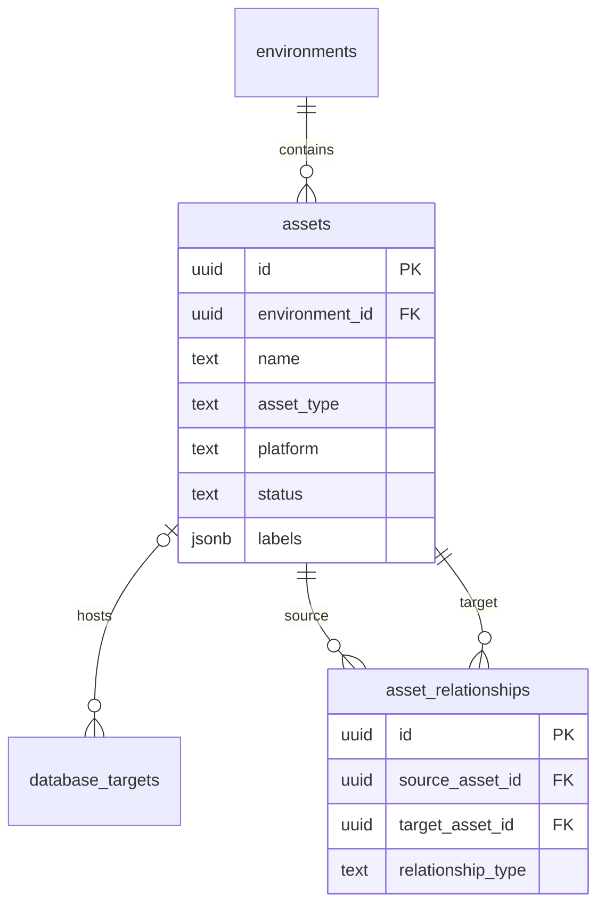

# Data Model

PostgreSQL is Heartbeat's durable system of record for **product metadata**:
inventory, monitored-target metadata, investigation requests and results,
alert and report metadata. It is not a telemetry store.

The schema is defined in
[`db/migrations/0001_foundations.up.sql`](../../db/migrations/0001_foundations.up.sql),
which is authoritative. If this page and the migration disagree, the migration
wins; please fix this page.

> **Status:** the schema is migrated and covered by tests, but no service
> reads or writes it yet. The planned API (`apps/api`) will be the first
> consumer. The DB collector takes its targets from YAML, not these tables
> ([ADR 0002](decisions/0002-runtime-config-in-yaml.md)).

## What PostgreSQL does not store

See [ADR 0001](decisions/0001-postgresql-metadata-only.md) for the reasoning.

| Data | Where it lives instead |
| --- | --- |
| Raw or derived metrics, live alert evaluation | Prometheus |
| Raw or normalized logs, session evidence | Loki |
| Alert grouping, deduplication, silencing, delivery | Alertmanager |
| Queues, locks, retries, idempotency keys, short-lived caches | Redis |
| Integration endpoints, Grafana URL templates, credential references, collector desired state | `config/integrations.yaml` / Kubernetes ConfigMaps |
| Audit events | Append-only JSONL files (planned), shipped to Loki/SIEM |
| Report binaries | Object storage or filesystem (planned); PostgreSQL keeps only `artifact_uri` |

Tables deliberately **not** created in the MVP:

| Table | Why not |
| --- | --- |
| `outsystems_sources` | OutSystems is a source type, not a domain object parallel to applications. Its settings live in `telemetry_sources.config`. Promote to a table only if the settings become large, queryable or constraint-heavy. |
| `session_identity_mappings` | Sessions are high-volume, potentially sensitive and telemetry-derived; they are reconstructed from Loki/Prometheus at investigation time. |
| `integration_connections`, `grafana_links` | Deployment-owned YAML and URL templates. Add only if operators need UI-editable mappings. |
| `audit_events` | JSONL files in the MVP. Add only for relational audit search or compliance exports. |
| `collector_instances`, `collector_assignments` | Would conflict with YAML/Kubernetes as the collector's desired state. Runtime state is exposed via `/metrics`, `/readyz` and logs. |
| `assets`, `asset_relationships` | Deferred until SQL Server/host topology is in scope (see [deferred topology](#deferred-topology)). |

## Conventions

- Primary keys are UUIDs (`gen_random_uuid()`, `pgcrypto`).
- Every mutable table has `created_at` and `updated_at`.
- Status and type columns use `CHECK` constraints where values are stable
  (for example `status in ('active','disabled')`).
- `jsonb` is used only for flexible provider or rule configuration and labels,
  never for core relational data, and is not over-constrained early.
- Secrets are never stored. Columns such as `credential_ref` and `target_ref`
  hold references resolved at runtime.
- Prefer disabling (`status`, `enabled`) over deleting. Most foreign keys are
  `ON DELETE RESTRICT`.
- There is one ownership path per record. Application-owned rows derive their
  environment through `applications.environment_id` and do not duplicate it.

## Entity-relationship diagram

```mermaid
erDiagram
  users ||--o{ user_roles : has
  roles ||--o{ user_roles : grants

  environments ||--o{ applications : contains
  applications ||--o{ application_components : decomposes_into
  applications ||--o{ telemetry_sources : emits_from
  users |o--o{ normalization_rules : creates

  environments ||--o{ database_targets : contains
  database_targets ||--o{ probe_assignments : probes
  probe_definitions ||--o{ probe_assignments : defines

  environments ||--o{ investigations : scopes
  applications ||--o{ investigations : subject_of
  users ||--o{ investigations : creates
  investigations ||--o{ investigation_jobs : runs
  investigations ||--o{ investigation_results : produces
  investigations ||--o{ evidence_links : references

  applications ||--o{ alert_policies : owns
  applications ||--o{ adaptive_baselines : owns
  applications ||--o{ notification_routes : owns
  applications ||--o{ alert_events : receives
  alert_policies |o--o{ alert_events : emits

  report_templates ||--o{ report_schedules : schedules
  applications ||--o{ report_schedules : owns
  applications ||--o{ report_runs : reports
  report_schedules |o--o{ report_runs : triggers
  users |o--o{ report_runs : requests

  users {
    uuid id PK
    text email UK
    text display_name
    text status "active | disabled"
    timestamptz last_login_at
  }
  roles {
    uuid id PK
    text name UK
    text description
  }
  user_roles {
    uuid user_id PK,FK
    uuid role_id PK,FK
  }
  environments {
    uuid id PK
    text name
    text slug UK
    text type "production | staging | development | test"
    text description
    text status
    jsonb labels
  }
  applications {
    uuid id PK
    uuid environment_id FK
    text name
    text platform
    text owner_team
    text criticality "low | medium | high | critical"
    text status
  }
  application_components {
    uuid id PK
    uuid application_id FK
    text name
    text component_type
    text runtime_name
    jsonb labels
  }
  telemetry_sources {
    uuid id PK
    uuid application_id FK
    text source_type
    text ingest_mode "otlp | file | api | agentless"
    text status
    jsonb config
  }
  normalization_rules {
    uuid id PK
    text source_type
    text version
    boolean enabled
    jsonb rule_config
    uuid created_by FK "nullable"
  }
  database_targets {
    uuid id PK
    uuid environment_id FK
    text engine
    text name
    text host
    integer port
    text database_name "nullable"
    text status
    text credential_ref
    jsonb labels
  }
  probe_definitions {
    uuid id PK
    text engine
    text name
    text version
    text category
    integer default_interval_seconds
    integer timeout_ms
    text query_template
    boolean enabled
  }
  probe_assignments {
    uuid id PK
    uuid database_target_id FK
    uuid probe_definition_id FK
    integer interval_seconds
    boolean enabled
    jsonb config
  }
  investigations {
    uuid id PK
    uuid application_id FK
    uuid environment_id FK
    uuid created_by FK
    text status "queued | running | completed | failed | cancelled"
    text subject_type "user | ip | session | request"
    text subject_value
    timestamptz time_start
    timestamptz time_end
    jsonb query
  }
  investigation_jobs {
    uuid id PK
    uuid investigation_id FK
    text status
    timestamptz queued_at
    timestamptz started_at
    timestamptz finished_at
    text error_message
  }
  investigation_results {
    uuid id PK
    uuid investigation_id FK
    text summary
    text severity "info | warning | critical"
    jsonb result
  }
  evidence_links {
    uuid id PK
    uuid investigation_id FK
    text source_type
    text title
    text url
    timestamptz time_start
    timestamptz time_end
    jsonb metadata
  }
  alert_policies {
    uuid id PK
    uuid application_id FK
    text name
    text signal_type
    text severity
    boolean enabled
    jsonb condition
    jsonb labels
    text rendered_rule_ref
  }
  adaptive_baselines {
    uuid id PK
    uuid application_id FK
    text signal_key
    text window
    text method
    jsonb parameters
    timestamptz last_computed_at
  }
  notification_routes {
    uuid id PK
    uuid application_id FK
    text name
    text channel_type
    text target_ref
    jsonb routing_rules
    boolean enabled
    text alertmanager_route_ref
  }
  alert_events {
    uuid id PK
    uuid application_id FK
    uuid alert_policy_id FK "nullable"
    text status "firing | resolved | suppressed"
    text severity
    text fingerprint
    timestamptz started_at
    timestamptz resolved_at
    jsonb labels
  }
  report_templates {
    uuid id PK
    text name UK
    text description
    text template_type
    jsonb template_config
    boolean enabled
  }
  report_schedules {
    uuid id PK
    uuid application_id FK
    uuid report_template_id FK
    text cron_expression
    text timezone
    jsonb recipients
    boolean enabled
  }
  report_runs {
    uuid id PK
    uuid application_id FK
    uuid report_schedule_id FK "nullable"
    uuid requested_by FK "nullable"
    text status
    timestamptz time_start
    timestamptz time_end
    text artifact_uri
    timestamptz started_at
    timestamptz finished_at
  }
```

## Domains

### Identity and access

`users`, `roles`, `user_roles`. Intentionally minimal for the MVP: a shared
SRE/admin-style user is acceptable, with no permission tables, SSO tables or
environment-scoped RBAC yet. Disable users (`status = 'disabled'`) rather than
deleting them; foreign keys restrict deletion.

### Environment and inventory

| Table | Meaning | Examples |
| --- | --- | --- |
| `environments` | Top ownership boundary; everything observable belongs to exactly one. | `prod`, `staging` |
| `applications` | Business system operators care about. Belongs to one environment. | *Claims Portal* (`platform = outsystems_traditional`, `criticality = high`) |
| `application_components` | A part of an application: *what part of the app it is*, not where it runs. | OutSystems module `ClaimsWeb`, screen flow `Login`, worker `auth-worker` |
| `telemetry_sources` | A configured feed of telemetry for one application. No `environment_id`: it is derived through the application. | `source_type = outsystems`, `ingest_mode = api`, `config = {"log_labels":{"app":"Claims"}}` |
| `normalization_rules` | Versioned mappings from source-specific fields to Heartbeat's normalized fields. Scoped by source type and version, not environment. | `outsystems` / `default-log-v1`: `{"session_field":"SessionId","user_field":"UserId"}` |

OutSystems Traditional and Reactive are represented through
`applications.platform`, `application_components.component_type` and, where
necessary, `telemetry_sources.config`. Map default OutSystems log fields
faithfully first so existing SRE queries keep working.

### Database observability

`database_targets`, `probe_definitions`, `probe_assignments` describe monitored
databases and versioned probe policies for the future control-plane workflow.
Targets belong to an environment; `credential_ref` is a reference only.

- Probe definitions are versioned and disabled rather than deleted
  (`probe_assignments → probe_definitions` is `RESTRICT`).
- Deleting a target cascades only to its assignments.
- Every probe must be reviewed for non-blocking behavior before being assigned
  to a production target.
- There is deliberately no direct `application → database_target` relation.

Today the collector ignores these tables and reads targets and probes from
`config/integrations.yaml`; see
[database observability](database-observability.md).

### Investigations and evidence

`investigations` stores the question: application, derived environment,
subject (`user`, `ip`, `session`, `request`), time window and filters.
`investigation_jobs` tracks asynchronous execution; a partial unique index
allows only one queued or running job per investigation.
`investigation_results` stores bounded summaries, and `evidence_links` points to
Grafana, Loki or Prometheus views. Raw evidence is never copied into
PostgreSQL. Jobs, results and links cascade when an investigation is removed by
a retention job.

### Alerting

Alerting is application-owned. `alert_policies` stores policy intent, rendered
into Prometheus rules (`rendered_rule_ref`). `adaptive_baselines` stores computed
threshold parameters. `notification_routes` stores route intent and references
to Alertmanager routes. `alert_events` records alert lifecycle and fingerprints
from Alertmanager for history, reporting and investigation context;
`alert_policy_id` is nullable because external or unmapped alerts may arrive.
PostgreSQL never evaluates alerts.

### Reporting

Reporting is application-owned. `report_templates` defines structure,
`report_schedules` defines cadence, timezone and recipients, and `report_runs`
records executions. `report_schedule_id` is null for on-demand runs, and
`requested_by` is null for scheduled runs. `artifact_uri` is a pointer only.
Environment-level reports are a later aggregation across applications.

## Relationship and delete rules

| Child → parent | On delete | Notes |
| --- | --- | --- |
| `user_roles` → `users`, `roles` | restrict | Composite primary key `(user_id, role_id)` |
| `applications` → `environments` | restrict | Unique `(environment_id, name)` |
| `application_components` → `applications` | restrict | Unique `(application_id, name, component_type)` |
| `telemetry_sources` → `applications` | restrict | Index `(application_id, source_type, status)` |
| `normalization_rules` → `users` (`created_by`) | set null | Unique `(source_type, version)`; system rules have no creator |
| `database_targets` → `environments` | restrict | Unique `(environment_id, engine, host, port, coalesce(database_name,''))` |
| `probe_assignments` → `database_targets` | cascade | Unique `(database_target_id, probe_definition_id)` |
| `probe_assignments` → `probe_definitions` | restrict | Definitions unique by `(engine, name, version)` |
| `investigations` → `applications`, `environments`, `users` | restrict | `time_end >= time_start` |
| `investigation_jobs`, `investigation_results`, `evidence_links` → `investigations` | cascade | One active job per investigation |
| `alert_policies`, `notification_routes` → `applications` | restrict | Unique `(application_id, name)` |
| `adaptive_baselines` → `applications` | cascade | Unique `(application_id, signal_key, window, method)` |
| `alert_events` → `applications` | restrict | Unique `(application_id, fingerprint, started_at)` |
| `alert_events` → `alert_policies` | set null | |
| `report_schedules` → `applications`, `report_templates` | restrict | Unique `(application_id, report_template_id, cron_expression, timezone)` |
| `report_runs` → `applications` | restrict | |
| `report_runs` → `report_schedules`, `users` | set null | |

## Deferred topology

Added only when SQL Server or host topology work needs explicit inventory.
Assets describe *where things run*; keep them minimal so they don't turn into a
CMDB.

Planned hooks when enabled: `database_targets.asset_id` (nullable, set null),
`applications.primary_asset_id`, `application_components.asset_id`, unique
`assets(environment_id, name)` and
`asset_relationships(source_asset_id, target_asset_id, relationship_type)`.
Examples: `prd-iis-01` (server, windows), `sql-prod-01` (database_server,
sqlserver), `public-lb` (load_balancer, nginx).
