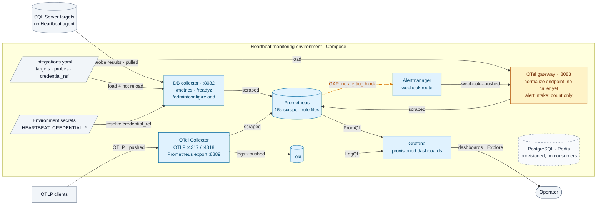
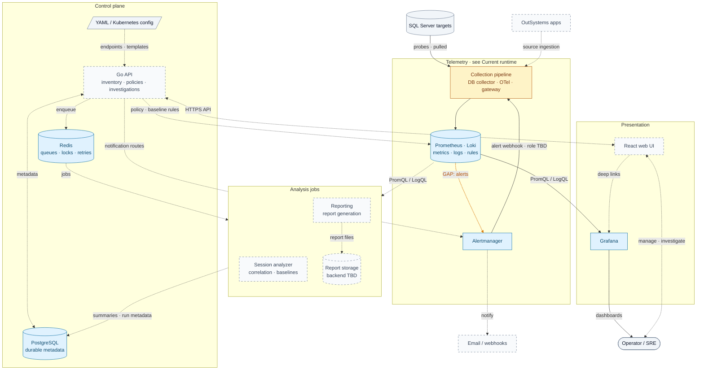

# Architecture diagrams — revision draft

Draft replacements for the two diagrams in [overview.md](overview.md). Not yet
adopted; review before replacing the originals.

**Conventions (both diagrams)**

- Arrows follow the direction data moves. Labels say whether it is *pulled*
  (scraped/queried by the receiver) or *pushed* by the sender.
- Colour encodes status only: **blue** implemented, **amber** partial,
  **dashed gray** planned or idle. Shape encodes type: cylinder = store,
  parallelogram = configuration, rounded = person.
- Solid edges are implemented/configured; dashed edges are planned; the
  **amber edge** marks a known gap in otherwise-implemented components.

## Current runtime

Self-scrapes (Prometheus, Loki, Alertmanager) are omitted. The collector also
reloads on SIGHUP and, when `HEARTBEAT_CONFIG_WATCH_INTERVAL` is set, on file
change.

## Target platform

The implemented collection pipeline and the Prometheus/Loki pair are collapsed
into single nodes; see the diagram above for their internals. Columns follow the
planes in [Core systems](overview.md#core-systems).

Open questions surfaced by the redraw:

- What does the gateway's alert intake become — persisted investigation
  events (via the API into PostgreSQL), or removed once Alertmanager delivers
  directly?
- Should the gateway export normalized events to the OTel Collector, and should
  its Compose `depends_on: otel-collector` wait for that?
- Who renders `infra/prometheus/rules/generated/` — the API (as drawn) or a
  build step?
