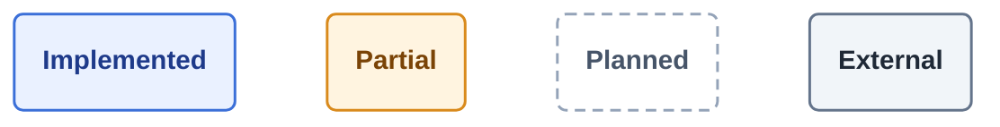
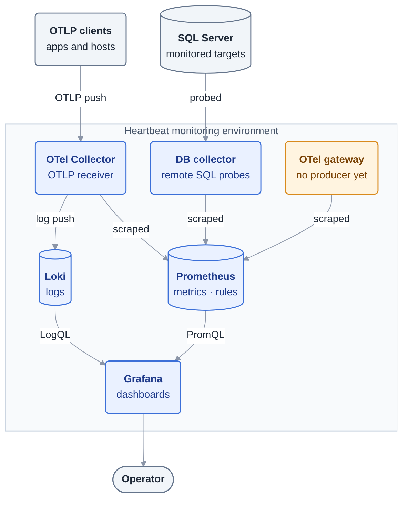
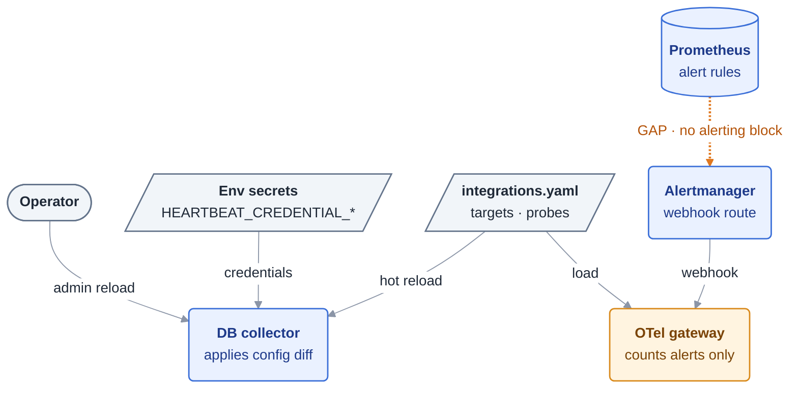
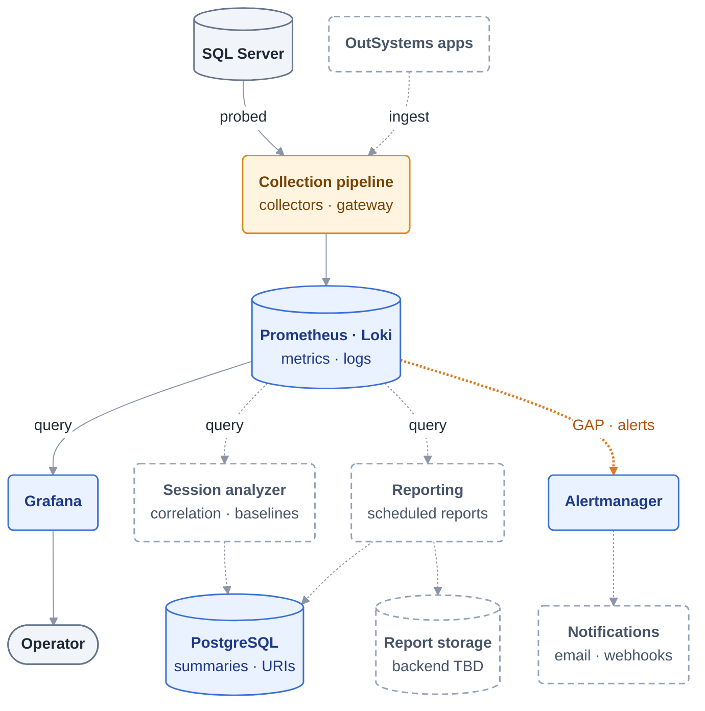
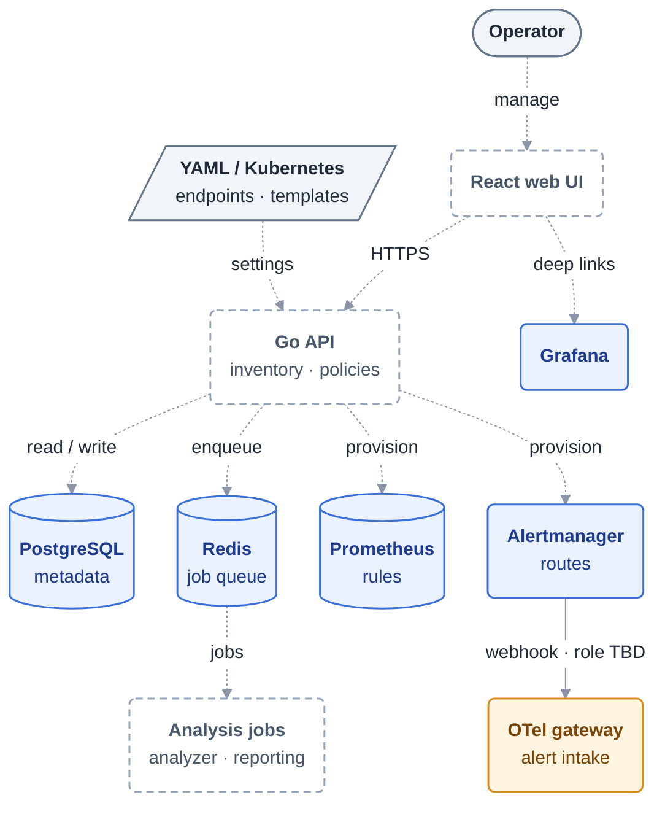

# Heartbeat Architecture Overview

Heartbeat collects telemetry from a separate monitoring environment. SQL Server
hosts run no Heartbeat agents. Metrics and logs belong in Prometheus and Loki;
PostgreSQL holds the durable metadata used by the planned control plane.

## How to read the diagrams

The runtime and target views are each split into two focused diagrams so every
diagram stays readable without zooming. Ports, endpoints and other detail live
in the [component details](#component-details) table rather than inside boxes.

- Arrows point the way information moves: telemetry flows toward the operator;
  commands and configuration flow away from the operator.
- Colour shows status. Shape shows type: cylinders are stores, slanted boxes
  are configuration, pills are people.
- Solid lines are implemented or configured connections, not proof of a
  successful live deployment. Dotted lines are planned. The **orange line**
  marks a known gap between implemented components.

## Current runtime

These diagrams reflect the checked-in services and Compose configuration.

### Telemetry path

How SQL Server probes and OTLP data reach the operator. SQL Server hosts run
no Heartbeat agent; the DB collector probes them remotely.

The default integration file has no SQL Server targets. Configure a target using
the [database onboarding runbook](../runbooks/database-targets.md), or use the
[local development sandbox](../runbooks/local-dev.md), to collect database metrics.
The SQL metric path has no PostgreSQL dependency, Redis queue, or durable
collector-side sample buffer.

### Configuration and alerting

How the collectors are configured, and where the alert path currently stops.

### Component details

| Component | Endpoints | Notes |
| --- | --- | --- |
| DB collector | `:8082` — `/metrics`, `/healthz`, `/readyz`, `/admin/config`, `POST /admin/config/reload` | Reload also on SIGHUP, and on file change when `HEARTBEAT_CONFIG_WATCH_INTERVAL` is set. Credentials resolved from `HEARTBEAT_CREDENTIAL_*`. |
| OTel Collector | OTLP `:4317` gRPC / `:4318` HTTP; Prometheus export `:8889`; health `:13133` | Drops `user_id`, `session_id`, `request_id`, `client_ip` from log attributes. |
| OTel gateway | `:8083` — `/metrics`, `/healthz`, `/readyz`, `POST /v1/heartbeat/events`, `POST /v1/heartbeat/alerts` | Events are normalized and returned to the caller, not exported. Alerts are counted, not stored or delivered. |
| Prometheus | `:9090` | 15s scrape. Rule files `heartbeat.rules.yml` and `generated/` (currently empty). No `alerting` block. |
| Alertmanager | `:9093` | One `default` webhook receiver pointing at the gateway, `send_resolved: true`. |
| Loki / Grafana | `:3100` / `:3000` | Grafana provisioned with Prometheus (default) and Loki data sources. |
| PostgreSQL / Redis | `:5432` / `:6379` | Provisioned in Compose; no service reads or writes them yet. |

Self-scrapes of Prometheus, Loki and Alertmanager are omitted from the diagrams.
OutSystems ingestion is still pending.

## Target platform

The target adds operator workflows around the telemetry path. The implemented
collection pipeline is shown as a single box; see
[Current runtime](#current-runtime) for its internals. An existing store does
not imply that its planned consumers are implemented.

### Data and analysis

How collected telemetry becomes dashboards, investigations, reports and
notifications.

### Operator workflows and control

How the planned web UI and API manage metadata, schedule jobs, and provision
rules and notification routes.

Session analysis owns correlation and baselines; reporting owns report
generation. Their queue protocol, scheduling details, artifact backend, and
provisioning interfaces still need to be defined. Baseline metadata lives in
PostgreSQL; live rule evaluation belongs in Prometheus. Audit JSONL output and
optional DB evidence snapshots are omitted from this overview; the collector's
current evidence sink does not retain them.

## Open questions

- What does the gateway's alert intake become — persisted investigation
  events (via the API into PostgreSQL), or removed once Alertmanager delivers
  notifications directly?
- Should the gateway export normalized events to the OTel Collector, and should
  its Compose `depends_on: otel-collector` wait for that?
- Who renders `infra/prometheus/rules/generated/` — the API (as drawn) or a
  build step?

## Data ownership and boundaries

| System | Owns | Boundary |
| --- | --- | --- |
| PostgreSQL | Inventory, policy intent, investigation summaries, evidence links, baseline versions, report-run metadata | No raw telemetry, raw sessions, audit streams, or report binaries |
| YAML / Kubernetes | Integration endpoints, Grafana URL templates, collector desired runtime state, credential references | Active collector targets/probes come from config, not PostgreSQL |
| Prometheus | Metric time series and executable recording/alert rules | Metrics are scraped from collectors; no SQL metric buffering in Redis/PostgreSQL |
| Loki | Logs and queryable operational evidence | High-cardinality investigation identifiers belong in payloads rather than index labels |
| Redis | Transient job queues, retries, locks, short-lived caches | Not the durable source of investigation or report state |
| Artifact storage (planned) | Generated report files | PostgreSQL retains the artifact URI only; backend is undecided |

Application-owned workflows derive environment from `applications.environment_id`.
Remote SQL probes must respect query budgets and least-privilege access. Collector
recovery, replica ownership, fencing, and downstream buffering remain
[planned reliability work](database-observability.md#collector-recovery-and-high-availability-planned).
Oracle is a future target; Grafana Alloy is a later comparison, not a selected
replacement in the current architecture.

## Implementation references

These diagrams were checked against the repository on 2026-09-29; this is a
source/configuration review, not live runtime validation.

- [Compose services](../../infra/docker-compose.yml),
  [Prometheus scrape/rule configuration](../../infra/prometheus/prometheus.yml),
  [OTel pipelines](../../infra/otel-collector/config.yaml), and
  [Alertmanager route](../../infra/alertmanager/alertmanager.yml).
- [DB collector wiring](../../services/db-collector/internal/app/app.go),
  [probe runner and evidence sink](../../services/db-collector/internal/collectors/runner.go),
  and [gateway HTTP handlers](../../services/otel-gateway/internal/app/app.go).
- [Integration configuration](../../config/integrations.yaml),
  [Grafana data sources](../../infra/grafana/provisioning/datasources/datasources.yml),
  [session analysis](session-analysis.md), [alerting](alerting.md), and
  [implementation checklist](../../TODO.md).

## Core systems
- Control plane: Go API, PostgreSQL metadata, Redis for async coordination
- Collection plane: OTel Collector and DB collectors
- Storage/query plane: Prometheus, Loki, PostgreSQL
- Analysis plane: session analyzer, adaptive baselines, reporting jobs
- Presentation plane: React UI and Grafana deep links

## Boundary decisions
- PostgreSQL => durable metadata only
- YAML/Kubernetes => integration endpoints, dashboard URL templates, collector desired runtime state
- Redis => transient queues, locks, retries, short-lived caches
- Loki/Prometheus => operational evidence and telemetry

## Monorepo layout
- `apps/api`
- `apps/web`
- `services/otel-gateway`
- `services/db-collector`
- `services/session-analyzer`
- `services/reporting`
- `packages/config-schema`
- `packages/telemetry-contracts`
- `infra`
- `db/migrations`
- `tests`
