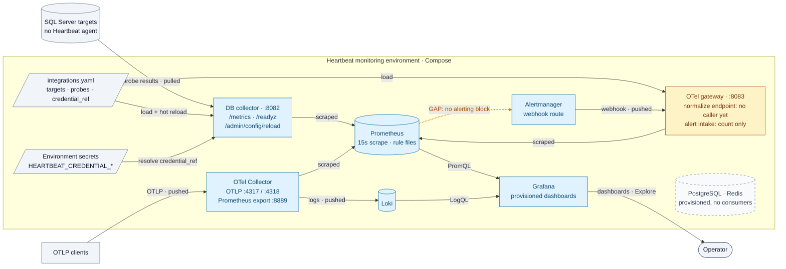
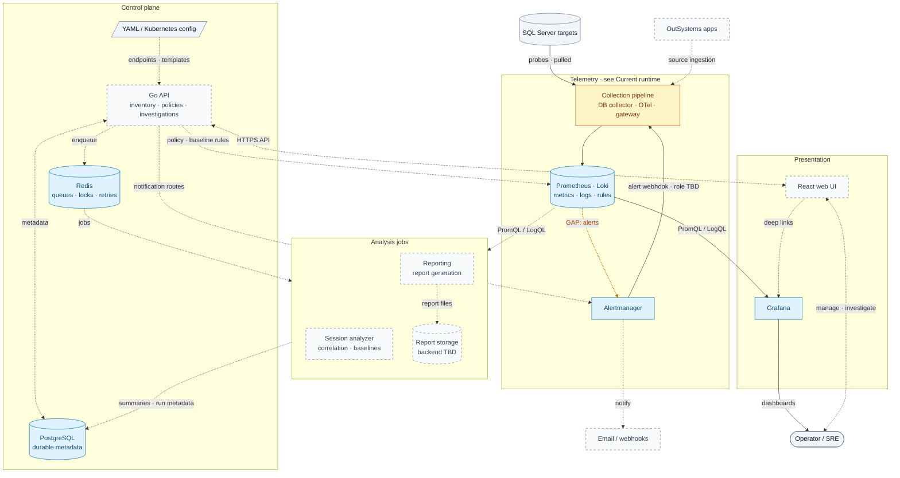

# Heartbeat Architecture Overview

Heartbeat collects telemetry from a separate monitoring environment. SQL Server
hosts run no Heartbeat agents. Metrics and logs belong in Prometheus and Loki;
PostgreSQL holds the durable metadata used by the planned control plane.

## How to read the diagrams

- Arrows follow the direction data moves. Labels say whether it is *pulled*
  (scraped/queried by the receiver) or *pushed* by the sender.
- Colour encodes status only: **blue** implemented, **amber** partial,
  **dashed gray** planned or idle. Shape encodes type: cylinder = store,
  parallelogram = configuration, rounded = person.
- Solid edges are implemented or configured connections, not proof of a
  successful live deployment. Dashed edges are planned; the **amber edge** marks
  a known gap in otherwise-implemented components.

## Current runtime

This diagram reflects the checked-in services and Compose configuration.

The default integration file has no SQL Server targets. Configure a target using
the [database onboarding runbook](../guides/database-targets.md), or use the
[local development sandbox](../guides/local-development.md#sql-server-sandbox), to collect database metrics.
The SQL metric path has no PostgreSQL dependency, Redis queue, or durable
collector-side sample buffer.

Self-scrapes (Prometheus, Loki, Alertmanager) are omitted. OutSystems ingestion
is still pending.

### Component details

| Component | Endpoints | Notes |
| --- | --- | --- |
| DB collector | `:8082` — `/metrics`, `/healthz`, `/readyz`, `/admin/config`, `POST /admin/config/reload` | Reload also on SIGHUP, and on file change when `HEARTBEAT_CONFIG_WATCH_INTERVAL` is set. Credentials resolved from `HEARTBEAT_CREDENTIAL_*`. |
| OTel Collector | OTLP `:4317` gRPC / `:4318` HTTP; Prometheus export `:8889`; health `:13133` | Drops `user_id`, `session_id`, `request_id`, `client_ip` from log attributes. |
| OTel gateway | `:8083` — `/metrics`, `/healthz`, `/readyz`, `POST /v1/heartbeat/events`, `POST /v1/heartbeat/alerts` | Events are normalized and returned to the caller, not exported. Alerts are counted, not stored or delivered. |
| Prometheus | `:9090` | 15s scrape. Rule files `heartbeat.rules.yml` and `generated/` (currently empty). No `alerting` block. |
| Alertmanager | `:9093` | One `default` webhook receiver pointing at the gateway, `send_resolved: true`. |
| Loki / Grafana | `:3100` / `:3000` | Grafana provisioned with Prometheus (default) and Loki data sources. |
| PostgreSQL / Redis | `:5432` / `:6379` | Provisioned in Compose; no service reads or writes them yet. |

## Target platform

The target adds operator workflows around the telemetry path. The implemented
collection pipeline and the Prometheus/Loki pair are collapsed into single
nodes; see [Current runtime](#current-runtime) for their internals. Columns
are the planes described in [Core systems](#core-systems). An existing store does not
imply that its planned consumers are implemented.

Session analysis owns correlation and baselines; reporting owns report
generation. Their queue protocol, scheduling details, artifact backend, and
provisioning interfaces still need to be defined. Baseline metadata lives in
PostgreSQL; live rule evaluation belongs in Prometheus. Audit JSONL output and
optional DB evidence snapshots are omitted from this overview; the collector's
current evidence sink does not retain them.

## Open questions

- What does the gateway's alert intake become — persisted investigation
  events (via the API into PostgreSQL), or removed once Alertmanager delivers
  notifications directly?
- Should the gateway export normalized events to the OTel Collector, and should
  its Compose `depends_on: otel-collector` wait for that?
- Who renders `infra/prometheus/rules/generated/` — the API (as drawn) or a
  build step?

## Data ownership and boundaries

| System | Owns | Boundary |
| --- | --- | --- |
| PostgreSQL | Inventory, policy intent, investigation summaries, evidence links, baseline versions, report-run metadata | No raw telemetry, raw sessions, audit streams, or report binaries |
| YAML / Kubernetes | Integration endpoints, Grafana URL templates, collector desired runtime state, credential references | Active collector targets/probes come from config, not PostgreSQL |
| Prometheus | Metric time series and executable recording/alert rules | Metrics are scraped from collectors; no SQL metric buffering in Redis/PostgreSQL |
| Loki | Logs and queryable operational evidence | High-cardinality investigation identifiers belong in payloads rather than index labels |
| Redis | Transient job queues, retries, locks, short-lived caches | Not the durable source of investigation or report state |
| Artifact storage (planned) | Generated report files | PostgreSQL retains the artifact URI only; backend is undecided |

Application-owned workflows derive environment from `applications.environment_id`.
Remote SQL probes must respect query budgets and least-privilege access. Collector
recovery, replica ownership, fencing, and downstream buffering remain
[planned reliability work](database-observability.md#collector-recovery-and-high-availability-planned).
Oracle is a future target; Grafana Alloy is a later comparison, not a selected
replacement in the current architecture.

## Implementation references

These diagrams were checked against the repository on 2026-09-29; this is a
source/configuration review, not live runtime validation.

- [Compose services](../../infra/docker-compose.yml),
  [Prometheus scrape/rule configuration](../../infra/prometheus/prometheus.yml),
  [OTel pipelines](../../infra/otel-collector/config.yaml), and
  [Alertmanager route](../../infra/alertmanager/alertmanager.yml).
- [DB collector wiring](../../services/db-collector/internal/app/app.go),
  [probe runner and evidence sink](../../services/db-collector/internal/collectors/runner.go),
  and [gateway HTTP handlers](../../services/otel-gateway/internal/app/app.go).
- [Integration configuration](../../config/integrations.yaml),
  [Grafana data sources](../../infra/grafana/provisioning/datasources/datasources.yml),
  [operator workflows](workflows.md), [data model](data-model.md), and
  [implementation checklist](../../TODO.md).

## Core systems

Heartbeat is organized into four planes, the same four columns as the
[target platform](#target-platform) diagram.

| Plane | Components | Status | Details |
| --- | --- | --- | --- |
| Telemetry | Collection (DB collector, OpenTelemetry Collector, OTel gateway), storage and evaluation (Prometheus, Loki), alert routing (Alertmanager) | Implemented; gateway partial; Prometheus → Alertmanager not connected | [Current runtime](#current-runtime), [database observability](database-observability.md), [metrics and endpoints](../reference/metrics-and-endpoints.md) |
| Analysis jobs | Session analyzer (correlation, adaptive baselines), reporting, report storage | Planned | [Operator workflows](workflows.md) |
| Control plane | Go API, PostgreSQL (durable metadata), Redis (queues, locks, retries), YAML/Kubernetes config | Schema and config manager implemented; API planned | [Data model](data-model.md), [configuration](../reference/configuration.md), [decisions](decisions/README.md) |
| Presentation | Grafana dashboards, React web UI with Grafana deep links | Grafana implemented; UI planned | [Operator workflows](workflows.md) |

## Architectural guardrails

Rules every subsystem follows. The reasoning is recorded in the
[architecture decisions](decisions/README.md).

- The API never queries SQL Server directly; all database-specific collection
  stays in `db-collector`.
- Redis is never the system of record. Durable job and request state lives in
  PostgreSQL (`investigation_jobs`, `report_runs`); workers must be idempotent.
- Loki labels stay low-cardinality. User, session, request and IP identifiers go
  in the log body, never in labels.
- Adaptive alert math is not computed in Grafana dashboards. Services compute and
  version baselines; executable rules are rendered to Prometheus.
- Custom parsers never bypass the shared telemetry contract in
  `packages/telemetry-contracts`.
- There is one ownership path per record: application-owned rows derive their
  environment through `applications.environment_id`.
- Collector desired state comes from YAML/Kubernetes, not PostgreSQL. Runtime
  state is exposed through metrics, health endpoints and logs.
- The OTel gateway stays thin: stock OpenTelemetry Collector configuration first,
  custom Go code only for platform-specific parsing.

The repository layout is described in the [README](../../README.md#repository-layout).
