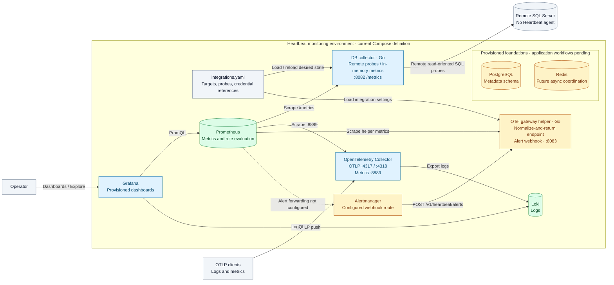
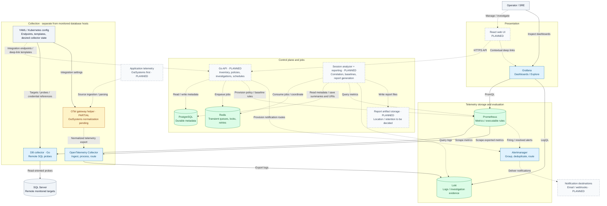

# Heartbeat Architecture Overview

Heartbeat collects telemetry from a separate monitoring environment. SQL Server
hosts run no Heartbeat agents. Metrics and logs belong in Prometheus and Loki;
PostgreSQL holds the durable metadata used by the planned control plane.

## Current runtime

This diagram reflects the checked-in services and Compose configuration. Solid
arrows show implemented calls or configured connections, not proof of a successful
live deployment. Dashed arrows identify missing connections. Arrow labels describe
the request or export direction: Prometheus **pulls** metrics and Grafana **queries**
its data sources.

The default integration file has no SQL Server targets. Configure a target using
the [database onboarding runbook](../runbooks/database-targets.md), or use the
[local development sandbox](../runbooks/local-dev.md), to collect database metrics.
The SQL metric path has no PostgreSQL dependency, Redis queue, or durable
collector-side sample buffer.

The gateway currently returns a normalized event to its HTTP caller; it does not
forward that event into the OTel Collector. Its alert endpoint accepts and counts
webhook payloads but does not persist alert events or deliver notifications.
Prometheus has scrape/rule configuration but no `alerting` block connecting it to
Alertmanager. OutSystems ingestion is still pending. Routine infrastructure
self-scrapes are omitted above for clarity.

## Target platform

The design below adds the intended operator workflows around the telemetry path.
**Blue/green nodes** exist as services or infrastructure; **amber nodes** are
partial; **dashed gray nodes** are planned. Solid arrows are implemented/configured
connections; dashed arrows are planned integrations. An existing store does not
imply that its planned consumers are implemented.

The two worker services are grouped for readability; session analysis owns
correlation/baselines, and reporting owns report generation. Their queue protocol,
scheduling details, artifact backend, and provisioning interfaces still need to
be defined. Baseline metadata lives in PostgreSQL; live rule evaluation belongs
in Prometheus. Audit JSONL output and optional DB evidence snapshots are omitted
from this overview; the collector's current evidence sink does not retain them.

## Data ownership and boundaries

| System | Owns | Boundary |
| --- | --- | --- |
| PostgreSQL | Inventory, policy intent, investigation summaries, evidence links, baseline versions, report-run metadata | No raw telemetry, raw sessions, audit streams, or report binaries |
| YAML / Kubernetes | Integration endpoints, Grafana URL templates, collector desired runtime state, credential references | Active collector targets/probes come from config, not PostgreSQL |
| Prometheus | Metric time series and executable recording/alert rules | Metrics are scraped from collectors; no SQL metric buffering in Redis/PostgreSQL |
| Loki | Logs and queryable operational evidence | High-cardinality investigation identifiers belong in payloads rather than index labels |
| Redis | Transient job queues, retries, locks, short-lived caches | Not the durable source of investigation or report state |
| Artifact storage (planned) | Generated report files | PostgreSQL retains the artifact URI only; backend is undecided |

Application-owned workflows derive environment from `applications.environment_id`.
Remote SQL probes must respect query budgets and least-privilege access. Collector
recovery, replica ownership, fencing, and downstream buffering remain
[planned reliability work](database-observability.md#collector-recovery-and-high-availability-planned).
Oracle is a future target; Grafana Alloy is a later comparison, not a selected
replacement in the current architecture.

## Implementation references

These diagrams were checked against the repository on 2026-09-27; this is a
source/configuration review, not live runtime validation.

- [Compose services](../../infra/docker-compose.yml),
  [Prometheus scrape/rule configuration](../../infra/prometheus/prometheus.yml),
  [OTel pipelines](../../infra/otel-collector/config.yaml), and
  [Alertmanager route](../../infra/alertmanager/alertmanager.yml).
- [DB collector wiring](../../services/db-collector/internal/app/app.go),
  [probe runner and evidence sink](../../services/db-collector/internal/collectors/runner.go),
  and [gateway HTTP handlers](../../services/otel-gateway/internal/app/app.go).
- [Integration configuration](../../config/integrations.yaml),
  [Grafana data sources](../../infra/grafana/provisioning/datasources/datasources.yml),
  [session analysis](session-analysis.md), [alerting](alerting.md), and
  [implementation checklist](../../TODO.md).

## Core systems
- Control plane: Go API, PostgreSQL metadata, Redis for async coordination
- Collection plane: OTel Collector and DB collectors
- Storage/query plane: Prometheus, Loki, PostgreSQL
- Analysis plane: session analyzer, adaptive baselines, reporting jobs
- Presentation plane: React UI and Grafana deep links

## Boundary decisions
- PostgreSQL => durable metadata only
- YAML/Kubernetes => integration endpoints, dashboard URL templates, collector desired runtime state
- Redis => transient queues, locks, retries, short-lived caches
- Loki/Prometheus => operational evidence and telemetry

## Monorepo layout
- `apps/api`
- `apps/web`
- `services/otel-gateway`
- `services/db-collector`
- `services/session-analyzer`
- `services/reporting`
- `packages/config-schema`
- `packages/telemetry-contracts`
- `infra`
- `db/migrations`
- `tests`
