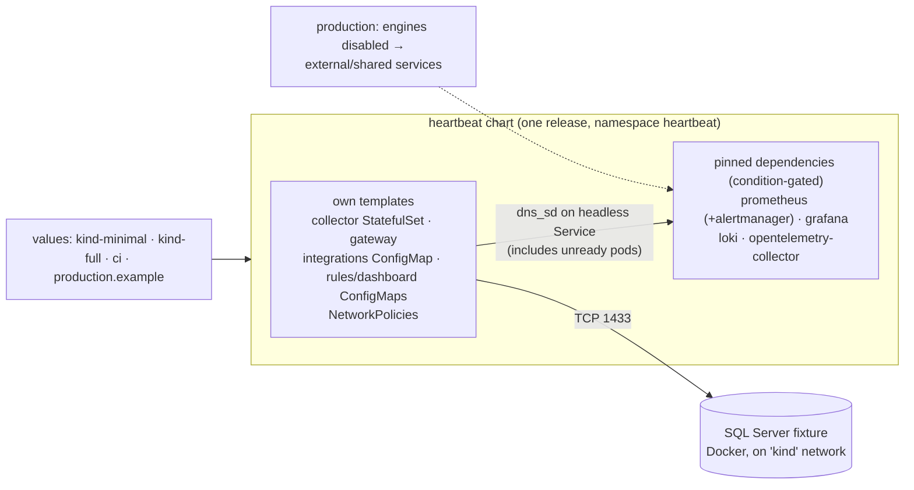

# Migration plan: Docker Compose → kind (local) + Helm (production)

Date: 2026-09-29, revised 2026-09-30. Status: proposed (revision 3: owner
answers folded in, see §10); nothing implemented.
Input: the [Compose-to-kind assessment](../reviews/2026-09-28-compose-to-kind-assessment.md)
(direction, risks, acceptance matrix). This plan keeps the assessment's
direction and acceptance matrix but deliberately departs from it, and from
revision 1 of this plan, where noted in §1.

## 1. Audit: inconsistencies found and what changed

Revision 1 was built on the assessment without challenging it. Re-reading
both against the code surfaced these problems.

| # | Problem (where) | Why it matters | Change |
| --- | --- | --- | --- |
| A1 | **helmfile as release declaration, but Argo CD recommended for production** (rev 1 D1 vs §9) | Argo CD does not render helmfile natively; we would keep helmfile for kind and Argo Applications for production — two release definitions, the drift the plan meant to avoid. | **One umbrella chart** with engines as pinned, condition-gated dependencies. Plain `helm`, Argo CD and CI all consume the same OCI artifact. No helmfile. (helmfile is a community project in the `helmfile` GitHub org, not part of the official Helm project; it would have been a third-party tool for a problem the umbrella chart solves with official Helm only.) |
| A2 | **kube-prometheus-stack for Heartbeat's own storage** (rev 1 D3, D4) | It is a *cluster-monitoring* distribution: cluster-scoped CRDs and an operator. Installing it in a production cluster that already runs one causes CRD/operator conflicts and needs cluster-admin. It also contradicts rev 1 §9.4 (a dedicated Heartbeat stack). For Heartbeat, Prometheus is **product storage**, not cluster monitoring. | Namespaced charts only: `prometheus-community/prometheus` (+ its Alertmanager), `grafana/grafana`. Existing `prometheus.yml` and rule files survive almost unchanged. No CRDs, no ClusterRoles required. |
| A3 | **Redis dropped for having no consumers, but PostgreSQL deployed plus a new migrations image** (rev 1 D5–D7) | Same fact, opposite decisions. Nothing reads PostgreSQL; the API that will is an empty scaffold. A migrations image/Job now pre-empts the API's design (usually `api migrate` from the API image with embedded migrations). | **Postgres and migrations leave the deployed stack** until the API exists. The schema smoke test keeps its disposable fixture (A6). |
| A4 | **Migration as Helm hook *and* `make migrate`** (rev 1 D6, §6); the hook's DSN Secret ordering was undefined | Two execution paths; a `pre-install` hook runs before same-release Secrets exist. | Removed with A3. Decide when the API lands (§10). |
| A5 | **"Replicas not a value, only 1 allowed"** (rev 1 §4) vs the assessment's host-run debugging path | Host-run debugging requires removing the in-cluster collector, or two collectors poll the same target. | `collector.enabled` toggle (0 or 1 instance). `make run-collector` disables the in-cluster collector first. |
| A6 | **Kubernetes fixture for schema tests while SQL Server stays a Docker fixture** (assessment §10, rev 1 D11) | Inconsistent principle: both are things Heartbeat *tests against*, not things it *deploys*. It would also make a 5-second schema test depend on a running cluster. | **Principle: what Heartbeat deploys → Helm; what Heartbeat tests against → Docker fixtures.** `docker-compose.test.yml` and the SQL Server target move to `infra/fixtures/`; test helpers change paths only. |
| A7 | **Integrations config as maps keyed by name** (rev 1 §4) | A third config format (values ≠ `integrations.schema.json` ≠ Go struct) and a second canonical source, contradicting the assessment's "one canonical source". | Values carry **complete `integrations.yaml` documents per environment**, embedded verbatim. The same schema and Go loader validate every copy; Helm's lack of list merging stops mattering. |
| A8 | **Deployment `Recreate` as the singleton guarantee** (assessment §6.1, rev 1 §4) | `Recreate` prevents overlap only during rollouts. On a node partition, the Deployment controller replaces a pod it cannot confirm dead, so two collectors can poll the same targets. | Collector becomes a **StatefulSet (1 replica, no volume)**. A StatefulSet will not replace a pod until that pod is confirmed gone: at-most-one semantics. Its required headless Service also solves scraping (A9). |
| A9 | **Scraping unready pods needed operator CRDs** (rev 1 D4) | PodMonitor exists only with prometheus-operator (see A2). | Headless Service with `publishNotReadyAddresses: true` + Prometheus `dns_sd_configs` (SRV on a named port) gives per-pod targets that include unready pods, labelled with the pod DNS name. No RBAC. An optional PodMonitor template remains for installs into an operator-based stack. |
| A10 | **`kubectl port-forward` for access** (assessment §8, rev 1 D10) | port-forward dies whenever its pod is replaced, and every collector update replaces the pod. Unsuitable for OTLP ingest from host apps. | kind `extraPortMappings` (bound to 127.0.0.1) + NodePort Services in kind values, on the Compose ports. Survives restarts. Bonus: the held host ports make the Compose platform fail to start while the kind cluster exists, a built-in guard against double collection. |
| A11 | **Tag = `<sha>-dirty-<diffhash>`** (rev 1 D8) | `git diff` ignores untracked files; a new Go file would not change the tag. | Tag = the built image's ID (`sha256:…` truncated): identical content gives the same tag, any change gives a new one. |
| A12 | **"NetworkPolicy off in kind unless a policy-enforcing CNI"** (rev 1 §4) | Wrong: kindnet enforces NetworkPolicy since kind v0.24. | Enable NetworkPolicy in kind so policy mistakes surface locally. |
| A13 | **Grafana with a PVC** (assessment §9) | Dashboards and datasources are provisioned from source; a PVC only preserves UI-made changes, which contradicts "dashboards as code" and adds a stateful component to back up. | Grafana is **stateless** (persistence off). Operators export dashboard changes to the repo. |
| A14 | **Everything local, always** (both documents) | The only working product path is SQL → collector → Prometheus → Grafana. Loki, OTel Collector and gateway have no local producers. | Two local profiles: `minimal` (default: collector, Prometheus, Alertmanager, Grafana) and `full` (+ Loki, OTel Collector, gateway). Umbrella conditions make this a values file. |
| A15 | **CI on kind arrives in PR 5 of 7** (rev 1 §8) | PRs 3–4 would merge without automated validation in a cluster. | kind smoke job lands with the first chart (PR 2); later PRs extend it. |
| A16 | **Missing production concerns** | Compose ships Grafana `admin/admin` with anonymous access; no plan for Grafana auth, notification secrets, retention sizing, or where production values live. | Added to the production track (§9) and decisions (§10). |
| A17 | **Credential rotation = restart** (env-var resolver) | Every rotation causes a collection gap on a singleton. | Follow-up, not a migration blocker: a `file/` credential resolver (the `CredentialResolver` interface already exists) reading a mounted Secret, which Kubernetes refreshes in place. |
| A18 | **Local Helm 4 vs production renderer** | Argo CD renders with its bundled Helm, which may be v3. | Chart `apiVersion: v2`, no Helm-4-only features; CI renders with the pinned Helm 4 and lints for Helm 3 compatibility. |

Kept from the assessment: shared Helm for kind/CI/production; SQL Server in
Docker; no Kustomize detour; singleton collector until target ownership exists;
liveness independent of SQL availability; the §12 acceptance matrix; clearly
named data-destroying targets; explicit cluster context everywhere.

## 2. Scope: what moves to Kubernetes

Owner direction: migrate everything to Kubernetes that makes sense, following best practices.
The line: **what Heartbeat deploys and operates runs in Kubernetes; systems Heartbeat
observes, and fixtures that stand in for them, stay outside.**

| Component | Where | Why |
| --- | --- | --- |
| DB collector, OTel gateway | Kubernetes (own templates) | Heartbeat's own services. |
| Prometheus, Alertmanager, Grafana, Loki, OTel Collector | Kubernetes (pinned dependencies) | Product storage, alerting and UI that Heartbeat operates. |
| PostgreSQL, Redis | Kubernetes, **when their first consumer (the API) lands** | Best practice is not to run unused stateful services (backups, upgrades, attack surface, RAM for nothing). Designed home: CloudNativePG in kind (and in production unless a managed database is chosen); Valkey/Redis official image. |
| SQL Server dev target | Docker, outside the cluster | It stands in for *external* monitored databases. Keeping it outside tests the real production path (cluster egress, DNS, NetworkPolicy egress). The image is also amd64-only while local kind nodes are arm64. |
| Postgres schema-test fixture | Docker (unchanged) | A throwaway dependency of a Go test, not a deployment. Replaced by an in-cluster migration test in kind CI once Postgres is deployed. |
| CI deployment tests | kind in GitHub Actions | Same cluster tooling as local. |

Kubernetes best practices adopted in the chart:
- Pod Security Admission `restricted` on the namespace.
- Default-deny NetworkPolicies with explicit allows.
- Probes and requests/limits on every workload.
- Dedicated ServiceAccounts without token automount.
- `app.kubernetes.io/*` labels.
- `values.schema.json` validation and a `helm test` smoke check.
- Image digests in production.
- kubeconform and `helm/chart-testing` in CI.

## 3. Version policy

Owner direction: latest stable, managed by us.

- **Pin exact versions everywhere**: tools (kind, kubectl, Helm, Go), node image by digest, chart
  dependencies in `Chart.lock`, container images (digests in production values). Never `latest` or floating tags.
- **Starting point = latest stable at PR 0**:
  - Kubernetes **1.36**: the newest minor Amazon EKS supports (upstream 1.37 is not on EKS yet).
    kind 0.33 image: `kindest/node:v1.36.4@sha256:099e049362a1526b2db71494e1947aae99bd16290d7c895f2b7ea312e3cbfaed`.
  - kubectl 1.35–1.37 (±1 skew): installed 1.32.3 must be upgraded.
  - Helm 4.2.x.
  - Go 1.27.x: `go.mod` and the Dockerfiles are on 1.26.0.
  - Current chart versions for Prometheus, Alertmanager, Grafana, Loki and the OTel Collector. Compose pins
    Prometheus 3.0.1, Grafana 11.4.0, Loki 3.3.2, Alertmanager 0.27.0 and otelcol 0.114.0, all well behind.
- **Upgrade engines before moving them** (PR 0b): bump Compose's image tags to the same versions and check
  dashboards/rules there, so the migration PRs debug Kubernetes issues only, not version issues.
  Risk is low: both dashboards use only `stat`/`timeseries` panels (no Angular panels removed by Grafana 12).
- **Stay current automatically with Renovate**. It opens PRs for Go modules, Dockerfile bases, Helm chart
  dependencies, image tags in values, GitHub Actions and, via regex rules, the kind node image and Makefile tool pins.
  kind CI must pass before merge. Patch/minor updates are grouped weekly; majors come one per PR with release notes.
- **Production rule** (AWS, ADR 0005): "latest stable" means the newest minor **EKS** supports.
  The kind node image moves to a new minor only when EKS offers it.

## 4. GitOps readiness (Argo CD later)

Owner direction: no Argo CD yet; it should come.

**What Argo CD is.** A controller that runs inside the cluster. It continuously compares
"what Git says should run" with "what is running", shows the difference, and applies
changes (sync). It can also revert manual drift (self-heal). Deployment becomes a Git commit:
CI builds and publishes images and charts but never touches the cluster; the cluster pulls.
Argo CD is a CNCF graduated project, installed with its own official Helm chart (`argo-helm`).

**Why it is worth it for Heartbeat.**
- No cluster credentials in CI.
- Every production change is a reviewed commit, and rollback is `git revert`.
- Drift from manual `kubectl edit` is visible and undone.
- The UI shows health and diffs, which helps while learning Kubernetes.

**Consequence: no interim push pipeline.** Production does not exist yet, so the production
track installs Argo CD as the *first* deploy mechanism instead of building a CI `helm upgrade`
pipeline to throw away later.

**How Helm fits.** Argo CD uses Helm only to render templates (`helm template`); it
applies the result itself. So there is no Helm release history (`helm list` is empty),
and rollback is done through Git or Argo CD. The chart must therefore:
- render deterministically: no `randAlphaNum`, `genCA` or `lookup` in templates (Argo re-renders on
  every refresh; random values rotate passwords, and `lookup` returns nothing). Secrets are created
  outside the chart: `make secrets` locally, a secret operator in production;
- not depend on `.Release.Revision`, `.Release.IsInstall` or `.Release.IsUpgrade`, and use Helm hooks only
  where Argo's hook mapping is acceptable (we currently need none);
- not create its own Namespace (Argo's `CreateNamespace` + `managedNamespaceMetadata` sets PSA labels; `make` does it in kind);
- stay renderable by Helm 3 as well as 4 (`apiVersion: v2`), because Argo CD bundles its own Helm.

**Where desired state lives.** Following Argo CD's best practices, use a **separate config repository**
(e.g. `heartbeat-deploy`) holding Argo `Application` manifests and per-environment values.
The source repo keeps the chart, the generic defaults and `production.example.yaml`. This separation gives:
- a clean audit trail;
- different write permissions for code and for production;
- no CI loop when CI commits a new version (CI in this repo opens a PR in the config repo to bump the chart/image version).

**Secrets with GitOps.** Plain Secrets cannot go into Git. The chart only consumes
`existingSecret` names, so any backend fits: External Secrets Operator (preferred once the
cloud's secret manager is known) or Sealed Secrets (cloud-agnostic, encrypted in Git).

**Local rehearsal.** The daily kind loop stays plain `helm upgrade`, because GitOps needs a
commit per change, which is too slow for development. An optional `make argocd` installs Argo CD in kind,
pointed at a branch of the config repo, to learn and test the GitOps flow before production.

## 5. Target shape



Repository layout:

```
infra/kind/cluster.yaml                 cluster "heartbeat", 1 node, pinned image, port mappings
infra/fixtures/sqlserver-dev/compose.yml   standalone; joins external network "kind"; loopback port
infra/fixtures/postgres-test/compose.yml   today's docker-compose.test.yml, unchanged content
deploy/charts/heartbeat/
  Chart.yaml  Chart.lock  values.yaml  values.schema.json
  templates/  collector-statefulset.yaml  collector-services.yaml  gateway.yaml
              configmap-integrations.yaml  configmap-rules.yaml  configmap-dashboards.yaml
              networkpolicies.yaml  podmonitor.yaml (optional)  _helpers.tpl
  files/dashboards/*.json   files/rules/*.yml   files/prometheus/scrape-configs.yml
deploy/values/{kind-minimal,kind-full,ci,production.example}.yaml
```

Removed at cutover: `infra/docker-compose.yml`, `infra/docker-compose.sqlserver-dev.yml`,
`infra/k8s/`, and `infra/{prometheus,grafana,loki,alertmanager,otel-collector}` configs
(moved into `files/` or values). Compose remains a tool for fixtures only.
`config/integrations.yaml` stays for host-run debugging.

## 6. Design details

**Collector**
- StatefulSet, `replicas: 1` fixed; `collector.enabled` is the only switch.
- Headless Service `db-collector-headless` (`publishNotReadyAddresses: true`, named port `http`)
  for scraping; a normal ClusterIP Service for admin/API traffic (ready pods only).
- Existing probes, `terminationGracePeriodSeconds: 45`, directory config mount (no `subPath`).
- Credentials: `envFrom` an existing Secret whose keys are the resolver's
  `HEARTBEAT_CREDENTIAL_<REF>` names (`credentials.existingSecret`); later `file/` refs (A17).
- Random admin token Secret generated per cluster; hardening: non-root, read-only root FS,
  no service-account token, requests/limits set after measurement.

**Config updates.** The collector's ConfigMap keeps a stable name and has no
checksum annotation: live reload, no restart gap. The gateway gets `checksum/config`
because it has no reload. Kubelet propagation takes up to about a minute; document it and add
`make reload` (bumps a pod annotation to trigger a prompt kubelet resync).

**Prometheus wiring across the umbrella.** Our templates create
fixed-name ConfigMaps (`heartbeat-prometheus-rules`, `heartbeat-grafana-dashboards`);
the prometheus dependency mounts the rules via `server.extraConfigmapMounts`
(and its config-reloader watches that directory), the grafana dependency loads
dashboards via its sidecar label. The scrape config is today's `prometheus.yml`
with the collector's static target replaced by `dns_sd_configs` (SRV) and an
`alerting:` block pointing at the bundled Alertmanager. This closes the existing
Prometheus → Alertmanager gap, so alerts will start reaching the gateway webhook. Add the
standard **Watchdog** rule (`vector(1)`) for the production dead-man's switch.
Fixed names imply one Heartbeat release per namespace (enforced in `values.schema.json` docs).

**Alert notifications.** Alertmanager has native receivers for all the owner's channels.
Webhook URLs are secrets (anyone holding one can post), so they come from a mounted Secret
via the receivers' `*_file` URL options, never from values or Git.

| Stage | Receiver | Notes |
| --- | --- | --- |
| Now (kind, early production) | `discord_configs` | Native since Alertmanager 0.25. |
| Production | `slack_configs` + `msteamsv2_configs` | Teams must use `msteamsv2` (Power Automate Workflows webhooks). Microsoft disabled the old Office 365 connector webhooks in May 2026, and the legacy `msteams_configs` depends on them. |
| Production, `severity=critical` only | `sns_configs` → SNS → Lambda → AWS End User Messaging Social (WhatsApp template) | No native Alertmanager WhatsApp receiver. WhatsApp needs approved templates, costs per message and reaches personal phones. Not in kind. |
| Always | existing `webhook_configs` → OTel gateway | Keeps the gateway's alert intake fed. |

Routing: `severity=critical` goes to every chat receiver; everything else goes to one channel. The route tree is
values-driven so the future API can take it over.

**Dead-man's switch.** Chat receivers cannot notice *silence*, so alerting-pipeline failure needs a
watcher outside the cluster. Use **healthchecks.io**:
- The Watchdog alert routes to a `webhook_configs` receiver that pings a check URL (`repeat_interval` ≈ 3m).
- The check expects a ping every 5 min with 5 min grace.
- If pings stop (Prometheus, Alertmanager, cluster or network down), healthchecks.io notifies Discord now, and Slack/Teams later. It supports all three.
- The free Hobbyist plan (20 checks) is enough. The service is open source, so it can be self-hosted later, but never inside the same cluster.

**Grafana access.** Owner decision: admin login for now, no SSO.
- kind: `admin/admin`, anonymous Viewer as today (bound to 127.0.0.1 only).
- Production: admin password from an `existingSecret` (generated, never in Git), anonymous access **off**, TLS at the ingress.
- SSO/OIDC is a later values change, not a redesign.

**Loki / OTel Collector.** Loki: single-binary, filesystem storage locally,
`chunksCache`/`resultsCache` disabled (the chart deploys memcached by default).
OTel Collector: deployment mode, contrib image, our pipeline supplied verbatim
with presets off.

**Integrations config.** Each values file carries `integrations: |` with a
complete document (kind: Service DNS internally, `http://localhost:3000` as the
Grafana browser URL). A Go test renders the chart for every values file and
loads the ConfigMap with `internal/config`.

**SQL Server connectivity.** The fixture joins the `kind` Docker network with
`container_name: heartbeat-sqlserver-dev`. Pods should resolve it because CoreDNS
forwards to the node's resolver, which is Docker's embedded DNS. **Verify in PR 1**:

```bash
kubectl --context kind-heartbeat run nettest --rm -it --restart=Never --image=busybox -- nc -zv heartbeat-sqlserver-dev 1433
```

Fallback: a selector-less Service with an Endpoints object set to the container's
`kind`-network IP by `make sqlserver-dev-up`. Either way `sqlserver-dev-up` requires `kind-up`.

## 7. Make interface (after cutover)

All calls pin `KUBE_CONTEXT := kind-$(KIND_CLUSTER)` (`KIND_CLUSTER ?= heartbeat`);
prerequisites are real dependencies (safe under `make -j`).

| Target | Does | Data |
| --- | --- | --- |
| `tools-check` | Fails on missing or skewed kind/kubectl/helm | — |
| `kind-up` / `kind-delete` | Create cluster if absent / delete it | delete **destroys** |
| `images` / `images-load` | Build collector + gateway, tag by image ID, load into the named cluster | — |
| `secrets` | Local Secrets from ignored `.env.sqlserver-dev` (`HEARTBEAT_*` keys only) + random admin token | — |
| `deploy` | `helm upgrade --install --wait` with `PROFILE=minimal\|full` | keeps |
| `dev` | `kind-up → images-load → secrets → deploy → health` | keeps |
| `run-collector` | Disable in-cluster collector, run it on the host against the fixture | — |
| `reload` / `health` / `status` / `logs` | Force config resync; curls on mapped ports; summaries | — |
| `undeploy` / `reset-data` | Uninstall keeping PVCs / delete PVCs (`CONFIRM=1`) | reset **destroys** |
| `sqlserver-dev-{init,up,down,reset,health}` | SQL fixture; only `reset` removes its volume | explicit |
| `chart-lint` | `helm lint`, render every values file, kubeconform | — |
| `test`, `test-race`, `vet`, `test-integration` | Unchanged behaviour; fixture path updated | disposable |

## 8. PR sequence (local + CI track)

Rough engineering days.

| PR | Scope | Gate | Est. |
| --- | --- | --- | --- |
| 0 | Commit pending Dockerfile platform fix + assessment + this plan; pin tools (kind node v1.36.4, kubectl 1.35–1.37, Helm 4.2, Go 1.27.1); `tools-check` | `tools-check` green; unit tests green on Go 1.27 | 0.5 |
| 0b | Bump Compose engine images to latest stable (§3); add Renovate config | Dashboards/rules work on new versions under Compose | 0.5 |
| 1 | `infra/kind/cluster.yaml` (port mappings), `kind-up/delete`, image build/tag/load, SQL fixture on `kind` network | Fresh cluster loads both images; pod → SQL TCP + auth works | 1 |
| 2 | Chart with collector StatefulSet, gateway, config, secrets; `chart-lint`, rendered-config test; **kind smoke CI job** | Collector ready in kind against the real fixture; CI green | 2 |
| 3 | prometheus/alertmanager/grafana dependencies, rules + dashboards, dns_sd scrape, Discord receiver, Watchdog → healthchecks.io, `minimal` profile | Fresh `heartbeat_collector_target_up` + populated SQL dashboard; unready collector still scraped; update shows no overlap; test alert lands in Discord; stopping Alertmanager triggers healthchecks.io | 2–2.5 |
| 4 | Loki + OTel Collector, `full` profile, NetworkPolicies | Full scope parity (Postgres/Redis deliberately excluded) | 1–1.5 |
| 5 | Cutover: fixtures to `infra/fixtures/`, Make defaults, delete platform Compose/Kustomize, README/runbooks/foundations tests/CI | `make dev` from fresh checkout green; CI has no platform-Compose step | 1 |
| 6 | Assessment §12 matrix (rows about migrations/PVC restore scoped to what exists) + Compose-vs-kind benchmark; evidence in `docs/reviews/` | Matrix passes; dev loop within budget | 1–2 |

| 7 (optional) | `make argocd`: Argo CD in kind syncing from a config-repo branch | Commit to config branch → change appears in kind; manual `kubectl edit` is reverted | 1 |

Total ≈ **9.5–11.5 days** + 1 optional (rev 1: 12–15; the savings come from A1, A3, A6 and A13).
No data migration: nothing reads Postgres, dashboards/rules come from source,
local telemetry is disposable.

## 9. Production track (after PR 2; needs the cloud decision in §10)

1. **Publish**: CI builds multi-arch images (amd64 + arm64) and pushes images + the chart to ECR (GitHub OIDC → IAM role),
   referenced by digest/version; `production.example.yaml` rendered and kubeconform-checked in CI.
2. **Config repo** `heartbeat-deploy`: Argo `Application` for Heartbeat, production values, and an
   `Application` for Argo CD itself (Argo CD manages its own upgrades). CI opens a version-bump PR there.
3. **Cluster bootstrap**: install Argo CD from its official chart (the one manual `helm install`), then
   point it at the config repo.
4. **Secrets**: External Secrets Operator (or Sealed Secrets if no cloud secret manager) providing
   the `existingSecret`s: SQL credentials, Grafana admin, Discord/Slack/Teams and healthchecks.io URLs.
5. **AWS infrastructure** (OpenTofu): EKS Auto Mode cluster, ECR, Secrets Manager entries, Pod Identity roles
   (ESO, Loki→S3, Alertmanager→SNS), SNS topic + WhatsApp Lambda, internal ALB + ACM for Grafana.
6. **Operations**: Grafana ingress + TLS; Prometheus/Loki retention and storage sizing; NetworkPolicies;
   Watchdog → healthchecks.io; first deploy, then a rehearsed rollback via `git revert`.

**~6–9 days** including AWS infrastructure as code (~2–3 days) and Argo CD bootstrap/learning (~1 day).
Meta WhatsApp Business verification runs in parallel and can take days; start it early.

## 10. Decisions and open questions

**Decided (2026-09-30)**

| Topic | Decision | Source |
| --- | --- | --- |
| Versions | Latest stable, exact pins, Renovate keeps them current (§3) | Owner |
| Deploy mechanism | Argo CD (GitOps) from the first production deploy; no interim push pipeline (§4) | Owner: "not yet, but should" |
| Grafana auth | Admin login; generated password + no anonymous access in production (§6) | Owner |
| Alert channels | Discord now; Slack + Teams (`msteamsv2`) for production (§6) | Owner |
| Dead-man's switch | healthchecks.io, notifying the same chat channels (§6) | Recommended; owner asked for a suggestion |
| Kubernetes scope | Everything Heartbeat deploys; observed systems and their fixtures stay outside (§2) | Owner direction + best practice |
| Chart orchestration | Umbrella chart; no helmfile (A1) | Revision 2 |
| Platform | AWS EKS, Kubernetes 1.36 | Owner (2026-09-30) |
| Registry | ECR for images and chart | Follows from AWS (ADR 0005) |
| Secrets | AWS Secrets Manager + External Secrets Operator (Pod Identity) | Owner asked Vault vs AWS; AWS chosen (ADR 0005) |
| WhatsApp | Critical-only via SNS → Lambda → End User Messaging Social | Owner request; design in ADR 0005 |
| Desired-state location | Separate `heartbeat-deploy` config repo (§4) | Argo CD best practice |
| Local dev data | Disposable | Assumed; nothing valuable is stored |
| PostgreSQL / Redis | Deployed with their first consumer (§2) | Best practice (YAGNI) |

**Still open. None blocks PRs 0–7.**

| Question | Recommendation | Blocks |
| --- | --- | --- |
| Where the monitored SQL Servers sit relative to the EKS VPC | Private connectivity (VPC peering/Transit Gateway, or VPN/Direct Connect for on-premises) | First production deploy |
| EKS Auto Mode vs managed node groups; OpenTofu vs Terraform | Auto Mode; OpenTofu (defaults in ADR 0005) | Production AWS infrastructure |
| Production Postgres (when the API lands) | RDS for PostgreSQL | API work, not this migration |

## 11. Verify early (cheap, could change the plan)

- Pod → `heartbeat-sqlserver-dev` DNS on the `kind` network (§6).
- Current canonical repo for the Loki chart (it may have moved to
  `grafana-community/helm-charts`) and its single-binary values.
- `prometheus-community/prometheus`: reloader watching an extra ConfigMap mount;
  disabling bundled kube-state-metrics/node-exporter/pushgateway.
- OTel Collector chart option for supplying the full config verbatim.
- Memory footprint of the `minimal` and `full` profiles.
