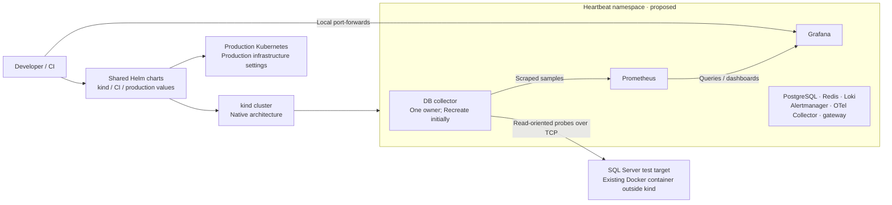

**Heartbeat: replacing Docker Compose with kind**

Assessment date: 2026-09-28. Status: recommendation for review; migration not implemented.

**Recommendation**

Move Heartbeat's platform services to Kubernetes and use Helm for both local kind and production deployment. Keep SQL Server in its existing Docker environment as an external monitored test target. Adapt Make, integration fixtures and CI as part of the migration. Retire the platform Compose definition once the replacement passes the acceptance tests.

The clarified target is coherent: kind supplies the local Kubernetes cluster; Helm supplies the shared application packaging and release workflow. Production uses a production Kubernetes cluster with the same versioned charts and environment-specific values. A particular production distribution, storage backend and ingress implementation still need selecting, but they do not prevent adopting this delivery model.

The existing bundle's missing services, image workflow and test dependencies are migration tasks, rather than reasons to maintain two permanent deployment systems. Build the shared Helm path directly; avoid completing a separate Kustomize deployment and then translating it again for production. Incremental validation within this migration reduces debugging scope without changing the intended end state.

**Why the technologies fit Heartbeat's goals**

The decision criterion is Heartbeat's intended operating model: collect remotely, deliver useful metrics/logs and investigation workflows, deploy reproducibly to cloud Kubernetes, and validate operational behavior before production. Existing implementation determines migration effort; it does not determine the preferred architecture.

| Technology | Characteristic relevant to the goal | Part in Heartbeat |
| --- | --- | --- |
| Docker / OCI images | Package executable applications and dependencies | Build distributable Heartbeat images; run kind nodes and the separate local SQL Server target |
| kind | Disposable local Kubernetes clusters | Exercise Kubernetes deployment behavior during development and integration CI |
| Production Kubernetes | Desired-state reconciliation, workload placement, service discovery and resource controls | Operate the production application and selected supporting services |
| Helm | Versioned templates, values and dependency packaging | Share application deployment definitions across local, CI and production environments |
| Go DB collector | Custom remote probes and controlled collection behavior | Query SQL Server without installing Heartbeat agents on database hosts |
| SQL Server | External database being observed | Docker-hosted test target locally; real monitored databases in production |
| OTel gateway helper | Application-specific normalization | Adapt application events to Heartbeat's contract; complete forwarding remains product work |
| OpenTelemetry Collector | Telemetry receiving, processing and export pipelines | Route application telemetry into the selected backends |
| Prometheus | Time-series collection, query and rule evaluation | Store/query operational metrics and evaluate alert rules |
| Loki | Log storage and querying | Retain log evidence for investigations |
| Grafana | Dashboards and exploration across data sources | Present telemetry and support investigation workflows |
| Alertmanager | Alert grouping, deduplication and routing | Deliver evaluated alerts through configured destinations |
| PostgreSQL | Durable relational metadata | Store control-plane inventory, policies and workflow records |
| Redis | Transient coordination and queues | Support planned asynchronous workers without becoming the telemetry store |
| Make and CI | Repeatable commands and automated validation | Hide routine setup mechanics and enforce deployment/application checks |

The telemetry and data responsibilities above follow the [project architecture](../architecture/overview.md); some workflows remain planned. Kubernetes and Helm provide deployment capabilities, not those product features. Helm's packaging model is described in the [chart documentation](https://helm.sh/docs/topics/charts/).

**Remaining concerns, ranked by effect on the goal**

1. **Monitoring availability during infrastructure failures.** If Heartbeat and every alert path depend on the same infrastructure being investigated, that infrastructure's failure can also remove the evidence and notification path. Choose the production monitoring failure domain deliberately and retain an external availability check or notification path where needed. A separate namespace alone is not a separate failure domain.
2. **Collector ownership and database load.** Kubernetes can replace or overlap pods, but does not know which replica owns a SQL target. Keep collection singleton until explicit target ownership exists, control update overlap, and test query budgets. These requirements follow from remote monitoring's need to avoid adding harmful load to the observed system. See [Deployment behavior](https://kubernetes.io/docs/concepts/workloads/controllers/deployment/).
3. **Durability and recovery.** Metadata and telemetry require different retention and recovery policies. PVCs provide a storage interface; they do not by themselves provide backup, replication or a verified restore. Select production storage and test recovery independently of successful pod startup. See [persistent storage](https://kubernetes.io/docs/concepts/storage/persistent-volumes/).
4. **Environment fidelity.** kind validates Kubernetes objects and application behavior, but local storage, networking and identity differ from cloud infrastructure. Use the same charts while testing production-specific values, ingress/TLS, credentials and SQL connectivity in the target environment before rollout.
5. **Release boundaries.** Keep application deployment, schema migration and stateful infrastructure upgrades explicit. Reverting a Helm release must not be assumed to reverse database changes or restore lost telemetry. Pin dependencies and avoid coupling every Heartbeat release to upgrades of all backends.
6. **Development cost.** The local cluster adds CPU/RAM use and operational concepts. Keep the initial topology small, preserve fast unit tests, and automate the normal development loop. Measure the cost rather than treating a slow first image download as steady-state performance.

These are design and validation requirements for the chosen direction. None is an intrinsic reason to retain Compose for the Heartbeat platform.

**1. Scope and evidence**

The user confirmed the intended direction: Compose → kind, with Helm for production, SQL Server retained in Docker, and Make/integration tests adapted. This assessment recommends Helm locally too. kind creates local Kubernetes nodes as containers, normally using the existing Docker environment; replacing Compose therefore does not by itself remove Docker or the macOS Linux VM. See the [kind quick start](https://kind.sigs.k8s.io/docs/user/quick-start/).

The review inspected the current working tree, including in-progress collector reliability changes. HEAD was `67e2bf0` when inspected. Files changed concurrently during the review: the final assessment credits the collector probes and 45-second termination grace period that appeared in the latest manifest. These are source observations, not independently verified runtime behavior.

Read-only checks completed:

- `docker compose -f infra/docker-compose.yml config --quiet`: passed.
- `docker compose -f infra/docker-compose.yml config --services`: nine services.
- `kubectl kustomize infra/k8s/local`: rendered successfully, including a second render after the collector manifest changed.
- Local tool inventory: ARM64 host, kind `v0.33.0`, kubectl `v1.32.3`, bundled Kustomize `v5.5.0`, Compose `v2.35.1-desktop.1`.

The initial assessment created no cluster, deployed no application, queried no database, and modified no live stack or volume. Rendering proves composition of manifests; it does not establish API-server admission, image execution, PVC binding, network reachability, or collection correctness. Existing test-suite results were not rerun or claimed as evidence for this assessment. Resource consumption and startup time remain unmeasured.

Subsequent user-authorized CPU build correction: both custom services were built with the local Docker Desktop builder for `linux/arm64` and `linux/amd64`. All four image OS/architecture declarations matched the extracted ELF executable architecture. Both ARM64 images ran in temporary containers and returned HTTP 200 for `/healthz`, `/readyz` and `/metrics`, using the default configuration with no SQL targets. Temporary containers were removed. AMD64 execution, SQL collection, and Kubernetes deployment were not tested. Build contexts included only Go source, module manifests and the Dockerfiles, excluding local credentials. Build logs and extracted binaries were retained under `/private/tmp/heartbeat-platform-ie3f7j3p` for this run.

**2. What exists today**

The authoritative inventory is [Compose](../../infra/docker-compose.yml) and the [Kustomize resource list](../../infra/k8s/local/kustomization.yaml), rather than the older README descriptions.

| Component | Compose definition | Kubernetes definition | Work needed for parity |
| --- | --- | --- | --- |
| DB collector | Built image, config mount, admin token, file polling | Deployment, Service, config mount; latest tree adds liveness/readiness and 45s shutdown grace | Correct image architecture/loading, rollout strategy, credentials, resource sizing, metrics access |
| OTel gateway helper | Built image and config mount | Deployment and Service | Build/load automation, probes, resource sizing, configuration restart policy |
| PostgreSQL | Named volume, migration mount, health check | StatefulSet, Service, 5Gi PVC template, development Secret | Migration workflow, readiness, storage lifecycle and restore policy |
| Redis | Container | Absent | Add if retaining complete platform parity; current SQL collection does not need it |
| Prometheus | Config, rules and persistent volume | Absent | Workload, Service, config/rules mounts, PVC, scrape strategy |
| Loki | Config and persistent volume | Absent | Workload, Service, config, PVC |
| Alertmanager | Config and persistent volume | Absent | Workload, Service, config, PVC |
| Grafana | Provisioned data sources/dashboards and persistent volume | Absent | Workload, Service, provisioning, PVC, browser access |
| Stock OTel Collector | OTLP ingest, metrics endpoint, health extension, log export | Absent | Workload, Services/ports, config, probes |
| SQL Server test target | Separate AMD64 overlay, credentials, health gating and volume | Intentionally external | Keep in Docker; decouple target startup from the platform overlay and verify access from kind pods |

The current SQL collection path is remote SQL Server → DB collector → Prometheus → Grafana. PostgreSQL is the metadata foundation for future control-plane workflows; the collector's current SQL metric path does not connect to it. The Kubernetes README's description of PostgreSQL as a collector requirement should be corrected during migration.

The gateway and stock OTel Collector are separate programs. Porting the gateway alone does not port OTLP ingestion. Missing Prometheus → Alertmanager wiring and the gateway's incomplete forwarding workflow are existing product gaps, not migration regressions. See the [architecture overview](../architecture/overview.md).

**3. What the change would buy**

| Decision factor | Compose | kind | Implication for Heartbeat |
| --- | --- | --- | --- |
| Daily edit/build/run loop | Fewer infrastructure steps; familiar existing commands | Build, load image, update workload and observe rollout | Automate the kind loop before changing the default |
| Kubernetes delivery confidence | Does not exercise Kubernetes objects | Exercises real API objects, scheduling, Services, projected config and workload lifecycle | Strong reason to adopt kind if production targets Kubernetes |
| Failure testing | Container/process failures | Adds pod replacement, readiness routing and Kubernetes deployment failures | Useful for the collector hardening work |
| Local resource cost | Application containers and Docker infrastructure | Same applications plus Kubernetes components and node runtime | Expect extra overhead; quantify it locally |
| Persistence | Named volumes | PVCs, StorageClasses, reclaim policies and node-local backing | More realistic APIs, more lifecycle decisions |
| Developer access | Published ports | Port-forwarding or deliberately configured entry points | Additional commands and port-conflict handling |
| SQL schema tests | Existing isolated disposable database fixture | Isolated namespaces/releases or dedicated disposable clusters | Adapt fixture and cleanup while preserving developer-data isolation |
| Production realism | Low for Kubernetes semantics | Better Kubernetes semantics; limited infrastructure fidelity | Cloud storage, load balancing, IAM and real failure domains still need other environments |
| Maintenance | Current platform definition | Additional manifests, overlays and cluster tooling | Share application config and limit the coexistence period |

kind is designed for testing. Several kind nodes on one laptop still share the laptop, VM, runtime and physical storage; they do not demonstrate independent-host availability. My recommendation is to use kind as a validation environment and target an appropriately operated Kubernetes platform for deployment. See [kind's design principles](https://kind.sigs.k8s.io/docs/design/principles/).

**4. CPU architecture: a routine image-build correction**

ARM64 is the CPU instruction set used by this Apple Silicon Mac. AMD64 means x86-64, used by both Intel and AMD processors. At the initial review, both [DB collector](../../services/db-collector/Dockerfile) and [gateway](../../services/otel-gateway/Dockerfile) Dockerfiles explicitly compiled with `GOARCH=amd64`, reflecting the intended production architecture. That always produced an Intel/AMD executable, even when the requested container platform was ARM64. The application's Go source does not need a rewrite.

The old base-image platform selection was not explicitly tied to that compiler target. A native ARM build could consequently package an AMD64 executable into an ARM image. Local emulation may mask this mismatch. This is a build-system task, not an architectural objection to kind.

The user-authorized correction now uses `FROM --platform=$BUILDPLATFORM` for native compilation and `TARGETOS`/`TARGETARCH` to compile for the requested image platform. The final image follows the selected target platform. AMD64 production builds remain available through `--platform linux/amd64`; native ARM64 builds use `--platform linux/arm64`. See [Docker multi-platform builds](https://docs.docker.com/build/building/multi-platform/). Both architectures passed image/binary checks, and both services passed native ARM64 HTTP smoke tests; see the evidence section above and the [build instructions](../runbooks/local-dev.md).

SQL Server remains in Docker, as requested, and is outside the Heartbeat Helm release. The [SQL Server overlay](../../infra/docker-compose.sqlserver-dev.yml) already sets `linux/amd64`; its existing execution environment is separate from the platform migration. The collector connects over TCP, so its CPU architecture does not need to match the database's. There is no requirement to move SQL Server into kind or change its host for this migration.

For development, build native `linux/arm64` Heartbeat images. For an AMD64 production cluster, build `linux/amd64` images from the same source. A published multi-platform image can provide both variants under one release tag. These changes apply to Heartbeat's two custom images; the external SQL Server fixture retains its own architecture settings.

**5. Cluster bootstrap and image lifecycle**

The current [Makefile](../../Makefile) does not provide a complete kind workflow:

- `k8s-up` builds only the DB collector and applies manifests.
- It does not create a cluster or invoke the separate kind image-load target.
- The bundle also references `heartbeat/otel-gateway:local`, but no corresponding Make target builds/loads it.
- `kubectl apply` and `delete` use the selected context implicitly; image loading targets kind's default cluster implicitly.
- Rebuilding the same `:local` tag and applying an unchanged Deployment does not itself request new pods. Cached images can make results confusing.
- Build and apply are independent Make prerequisites, so `make -j k8s-up` can apply before building finishes.

Use one explicitly named development cluster, a repository-owned kind configuration, pinned compatible node images, and explicit context/name parameters throughout. Encode the dependency chain: build both application images → load them into that cluster → apply the selected overlay → wait for readiness → run smoke checks. Give each build an identifiable tag that changes when local source changes; a Git SHA alone is insufficient for a dirty tree.

kind documents explicit image loading and named-cluster selection in its [image-loading workflow](https://kind.sigs.k8s.io/docs/user/quick-start/#loading-an-image-into-your-cluster).

The installed kubectl is `1.32.3`; the actual proposed Kubernetes server version remains undecided. Select compatible tooling before bootstrap rather than accepting an arbitrary default. kubectl support is within one minor version of the API server. See the [version-skew policy](https://kubernetes.io/releases/version-skew-policy/).

**6. Collector availability and the risks Kubernetes exposes**

The latest [collector manifest](../../infra/k8s/local/db-collector.yaml) now maps `/healthz` to liveness and `/readyz` to readiness, with a 45-second termination grace period. The current [runtime](../../services/db-collector/internal/app/app.go) distinguishes failed database targets from a failed collector process, supervises pollers, and implements reload rollback. These are useful foundations; moving to kind is not a substitute for validating them.

Three remaining design decisions matter:

1. **A single configured replica can still overlap during an update.** The manifest omits an explicit rollout strategy. Deployment defaults can create a replacement before the old pod stops, so two collectors may poll the same SQL targets. Use `Recreate` for the initial singleton deployment, accepting a collection gap. It reduces ordinary rollout overlap; it does not solve split-brain, force deletion, or network-partition ownership. True replica HA requires target assignment, leases/fencing or equivalent coordination. See [Deployment rollout behavior](https://kubernetes.io/docs/concepts/workloads/controllers/deployment/) and the project's [ownership plan](../architecture/database-observability.md).

2. **Readiness can hide failure evidence from Prometheus.** Copying the current `db-collector:8082` static scrape target into Kubernetes routes through a Service. An unready pod normally stops receiving Service traffic, although its HTTP metrics endpoint may still be serving useful failure information. Prefer explicit per-pod metrics discovery that intentionally includes unready pods, or a separate metrics-only Service configured to expose them. Keep metrics reachability separate from general traffic routing. Confirm that any selected monitoring chart does not drop unready endpoints. With multiple replicas, scraping a load-balanced Service also fails to give a reliable per-replica view. Kubernetes describes readiness routing in its [probe documentation](https://kubernetes.io/docs/concepts/workloads/pods/probes/).

3. **Restarts do not recover missed samples.** The collector exports from memory and does not have durable replay. Pod replacement, laptop suspension, and Prometheus outages can create gaps. Record recovery time and gaps explicitly. Do not call replica count or automatic restart a complete HA design.

Keep liveness independent of SQL Server availability. Evaluate a startup probe only if measured cold-start behavior needs one. The new 45-second grace period exceeds the source's 10s HTTP drain + 20s poller wait + 5s background wait budgets, but confirm behavior under a slow query and an active reload. Kubernetes eventually force-terminates processes that exceed their grace period; source timeouts alone do not prove clean shutdown. See [pod termination](https://kubernetes.io/docs/concepts/workloads/pods/pod-lifecycle/).

**7. Configuration, secrets and deployment ordering**

The Kubernetes [ConfigMap](../../infra/k8s/local/configmap-config.yaml) duplicates the tracked integration configuration. It contains endpoints for services the bundle does not yet deploy and has empty SQL target lists. A green readiness result with no configured targets cannot prove SQL collection works.

Generate environment configuration from a canonical source plus explicit environment overrides. Reuse Prometheus rules, Grafana dashboards and OTel pipeline files instead of maintaining independent copies. Define application-specific update behavior:

- The DB collector currently mounts the complete config directory, and its watcher checks the file and parent directory. Preserve that mount shape and test a projected-volume update. Kubernetes projection is eventual, so the configured 5-second watcher interval is not an end-to-end propagation guarantee. A `subPath` mount would prevent automatic ConfigMap updates. See [ConfigMap update behavior](https://kubernetes.io/docs/concepts/configuration/configmap/).
- The gateway loads its configuration at startup and does not have the collector's watcher. Plan a rollout for gateway config changes unless reload support is implemented.
- Choose explicitly between stable-name ConfigMaps with live reload and generated names/checksum changes that trigger rollouts. Accidentally restarting the singleton collector for every config edit adds avoidable collection gaps.

The checked-in Kubernetes Secret contains development defaults, and the collector Deployment does not inject an actual SQL Server target credential. Generate local Secrets from ignored files and map the exact environment variable names expected by the credential resolver. Credential rotation needs a documented refresh/restart path. Kubernetes Secret objects are not automatically a complete secret-management solution; encryption at rest and least-privilege access require configuration. See [Kubernetes Secrets](https://kubernetes.io/docs/concepts/configuration/secret/).

Compose's simple `depends_on` controls start ordering rather than application readiness; the SQL overlay deliberately uses `service_healthy`. Do not translate the whole dependency graph into init-container waits. The collector should remain able to start, report failed targets, and retry. PostgreSQL migrations should be a bounded, observable operation before future schema-dependent API workloads start. See [Compose startup ordering](https://docs.docker.com/compose/how-tos/startup-order/).

**8. Networking and local access**

Keep infrastructure Services private inside the cluster and begin with explicit localhost port-forwards for Grafana, Prometheus and collector diagnostics. Configure an ingress or load-balancer solution later only if browser/API workflow requires it. kind supports explicit host port mappings and host mounts, but these must be part of the cluster configuration. See [kind configuration](https://kind.sigs.k8s.io/docs/user/configuration/).

Same-namespace service names can preserve many existing internal URLs after the missing Services exist. External SQL targets need a separate reachability test from a pod. A laptop connection succeeding does not establish that the Docker VM, kind node and pod route succeeds through a VPN, DNS policy or firewall. A pod's `localhost` addresses that pod, and Compose service DNS is not automatically available inside Kubernetes.

For the retained Docker SQL Server, select and test one explicit network path. On Docker Desktop, `host.docker.internal` is a host-access mechanism, but do not assume that `host.docker.internal:11433` works from a kind pod with the existing loopback-only port binding. Alternatively, place the SQL target container on the kind nodes' Docker network and provide a stable, explicitly managed address to the collector. Check name resolution and TCP access from inside the pod; Docker network aliases are not automatically Kubernetes Service names. Preserve the current restricted exposure while designing this path. See [Docker Desktop networking](https://docs.docker.com/desktop/features/networking/).

The existing ConfigMap sets Grafana's base URL to cluster-internal DNS. That may be usable by other pods but is unsuitable for links opened in the laptop browser. Separate internal data-source URLs from public/browser-facing URLs, initially using the selected localhost access port for the latter.

If NetworkPolicy testing is a goal, choose and verify a networking implementation that enforces it. A successfully applied policy resource alone does not demonstrate enforcement. See [NetworkPolicy prerequisites](https://kubernetes.io/docs/concepts/services-networking/network-policies/).

**9. Persistence, data migration and recovery**

The current PostgreSQL manifest requests 5Gi and relies on the cluster's storage provisioning. It does not define a StorageClass or an external data directory. Confirm claim binding and the actual backing path during the pilot. A PVC API object is not a promise that data survives deleting the kind cluster.

Separate three lifetimes: pod replacement, cluster recreation, and application data retention. Provision local PVCs for the five services currently using named volumes: PostgreSQL, Prometheus, Loki, Alertmanager and Grafana. Define whether each store is disposable or recoverable. The storage backend and reclaim policy govern deletion behavior; deleting a namespace can remove its claims. See [PersistentVolume lifecycle](https://kubernetes.io/docs/concepts/storage/persistent-volumes/).

The existing `make down` uses Compose `down -v`; `k8s-down` deletes a bundle that includes the namespace. Neither is a good default name for a data-preserving pause. Introduce clear lifecycle operations for temporary stop, application removal, deliberate data reset and cluster deletion. Do not tie everyday shutdown to volume destruction.

For migration, first decide whether existing development data is valuable. Reprovision dashboards/rules from versioned source, and take a logical PostgreSQL backup/restore if metadata must be kept. Assess telemetry history separately; copying live database directories between storage backends is not a migration plan. Keep the Compose volumes intact during the pilot. If rollback is required, stop the kind collector before resuming Compose collection to avoid duplicate queries. Data written only after cutover needs its own reverse-migration decision.

Add a migration command or Job with bounded readiness waits, explicit SQL error handling, and observable completion. `make migrate` currently executes through Compose and the Kubernetes PostgreSQL pod lacks the Compose migration-directory mount. Do not run the foundation SQL automatically on every restart without defining repeatability and migration version tracking.

**10. Development workflow, CI and resource cost**

Use Helm for local development, CI and production from the start. Charts define shared Kubernetes resources; values select environment-specific settings. A proposed layout is `infra/kind/` for cluster configuration, `deploy/charts/heartbeat/` for application templates and chart metadata, and `deploy/values/{kind,ci,production}.yaml` for overrides. This is a proposal, not a directory change performed by this assessment. Helm's [chart model](https://helm.sh/docs/topics/charts/) supports templates, values, dependencies and optional value schemas.

Use one source for Heartbeat's workload definitions. Reuse pinned upstream charts for infrastructure where suitable, with explicit dependency versions. Shared third-party infrastructure may be installed as separate releases so upgrading Heartbeat does not require upgrading PostgreSQL or Prometheus. A local umbrella chart can assemble the full stack if that simplifies setup. Production values should support external/shared dependencies when the production platform supplies them.

| Setting | Local kind | Production Kubernetes |
| --- | --- | --- |
| Chart templates | Shared, versioned Heartbeat chart | Same chart version validated in CI |
| Images | Native local builds loaded into kind | Registry images pinned to a release/digest |
| Access | Local port-forwarding | Selected ingress/load balancer and TLS |
| Storage | Small local PVCs, explicit reset policy | Selected storage class, retention and backup policy |
| Secrets | Ignored development inputs | Existing production secret-management integration |
| SQL target | Docker test database outside kind | Actual monitored SQL Servers outside Heartbeat |
| Collector ownership | Singleton initially | Singleton until replica ownership is implemented; not a blind replica-count override |

Helm unifies packaging; it does not make local storage/networking identical to production or implement database migrations and collector ownership automatically. Validate the rendered production values separately from the local kind installation.

Provide a supported command sequence for prerequisites, cluster creation, build/load, apply, migrate, readiness, access, logs, reset and cleanup. Keep explicit cluster targeting throughout. For Go debugging, allow the service to run on the host against forwarded dependencies when useful; remove the in-cluster collector from that test path so both do not poll the same targets.

The [integration fixture](../../infra/docker-compose.test.yml), [test helper](../../tests/postgres_helpers_test.go), [foundation assertions](../../tests/foundations_test.go), and [CI workflow](../../.github/workflows/db-collector-ci.yml) explicitly depend on Compose today. Adapt them within the migration. Preserve the fixture's isolation guarantees: unique resources, disposable test data and cleanup scoped to the current run.

Recommended test split:

- Keep Docker-free Go tests, race tests and vet for application logic.
- Replace the Compose PostgreSQL fixture with a minimal Kubernetes fixture in a dedicated test cluster or unique per-run namespace/release, using disposable storage. Schema tests need not launch every observability service.
- Run chart lint/render checks for kind, CI and production values. Add kind deployment tests for images, mounts, probes, reload, scrape flow and replacement.
- Use bounded startup and cleanup, enforce explicit test cluster/context selection, and update foundation assertions and CI together. Keep the Docker SQL Server target independently managed, with a separate disposable target when a test can mutate database state.

Expect more idle memory, startup work, image transfers and disk use with kind. No percentage overhead or RAM minimum for Heartbeat was measured. The OTel config's 256MiB memory-limiter setting is only one component setting, not a full-stack requirement. Set resource requests/limits after measurement and leave process headroom around the OTel limiter.

Benchmark the same images, dataset and target count in both environments: three cold starts and warm rebuilds, steady-state CPU/memory, disk growth, time to first fresh SQL sample, and recovery after pod replacement. Separate image-download time from startup and ARM-native results from AMD64 emulation. Agree an acceptable developer-loop budget before changing the default.

**11. Proposed pilot and migration gates**

Start with one kind node and the smallest complete observable path: DB collector, Prometheus and Grafana against a dedicated test SQL target. Add the remaining services for full Compose parity. Add extra kind nodes only for a specific scheduling or node-failure experiment.

| Phase | Concrete result | Gate before continuing |
| --- | --- | --- |
| 1. Bootstrap and architecture | Compatible versions, platform-aware app images, explicit cluster, shared Helm chart, reliable build/load/install | Fresh checkout and empty named cluster start both app images reproducibly |
| 2. Observable SQL path | Collector → Prometheus → Grafana; existing Docker SQL target | Fresh expected series and populated dashboard; no duplicate collector ownership |
| 3. Full platform parity | Remaining six services, config/provisioning, credentials, migrations and persistence | Every required service and operator workflow matches the documented scope |
| 4. Failure and data tests | Measured replacement, reload, SQL outage and storage behavior | Acceptance matrix below passes with retained evidence |
| 5. Default switch | Adapted Make/tests, Helm development workflow, kind CI and production-values validation | Daily loop/resource cost acceptable; recovery rehearsed; platform Compose definitions retired |

The initial 4–9 engineering-day allowance covered a narrower migration that retained the Compose test fixture and deferred production packaging. It should not be reused unchanged for this clarified scope. Estimate the shared Helm packaging, Make/test adaptation and production-specific configuration together after selecting infrastructure chart dependencies and verifying kind-to-Docker SQL connectivity. Production HA ownership and operational certification remain separate from making the application deployable through Helm.

**12. Acceptance tests that distinguish a useful migration from a green deployment**

Run failure scenarios only against the disposable pilot and non-production targets.

| Experiment | Expected observation / pass condition |
| --- | --- |
| Fresh cluster and fresh image load | Both app images start on the node's actual CPU architecture; all expected workloads reach readiness; no manual cache repair |
| Render the same chart with kind, CI and production values | Valid resources and expected environment differences; no separate manually maintained production workload templates |
| Connect from kind to the retained Docker SQL target | Stable address and working DNS/TCP/authentication/TLS from a pod without widening database exposure unintentionally |
| Change application code and rebuild | Running image identity changes and the expected behavior appears; old `:local` image cannot mask the change |
| Configure one SQL target | `heartbeat_collector_target_up` and selected SQL probe metrics are fresh in Prometheus; Grafana shows the target |
| Apply valid ConfigMap update | Active config version changes after projection and reload; only intended collection changes occur |
| Apply invalid config | Previous valid configuration continues; rejection is visible; healthy collection remains available |
| Trigger a partial reload failure | Runtime returns to the prior configuration, or explicitly signals divergence and unready status; no silent mixed configuration |
| Make one monitored SQL target unavailable | Failed-target metrics change, healthy targets continue, and collector container restart count does not rise merely because the DB is down |
| Cause a collector lifecycle failure | Readiness degrades while process liveness behaves as designed; diagnostic metrics remain scrapable while HTTP is available |
| Update the singleton collector | Old process drains and exits before the new process polls; measure the collection gap and check SQL-side query concurrency |
| Replace a pod / interrupt downstream | Recovery time and missing/stale samples are measured; no claim of replay without implemented replay |
| Restart a stateful pod | Required stored data survives using the same claim; volume permissions remain correct |
| Recreate the disposable cluster | Outcomes match the declared persistence policy; a backup can restore data designated recoverable |
| Exercise migrations twice through the chosen workflow | Correct schema, deliberate repeat-run behavior, SQL errors fail the operation, and application readiness is not mistaken for schema readiness |
| Run concurrent CI jobs | Resources/data are isolated; cleanup cannot delete the developer namespace, cluster or database |
| Access SQL through the normal VPN/network | DNS, TCP, authentication and TLS succeed from a pod; laptop-only success is insufficient |
| Compare daily development loop | Measured startup/rebuild/resource costs meet the agreed budget |

**Recommended direction**

Proceed with a single Helm-based Kubernetes delivery model: kind locally and in integration CI, production Kubernetes for PRD, and SQL Server retained in Docker as an external development target. Include Make and integration-test adaptation in the implementation scope. Validate the migration in slices, starting with the SQL metrics path, then retire the platform Compose configuration after equivalent workflows pass. This assessment updates the proposed architecture; it does not implement the migration or select production infrastructure on the user's behalf.
