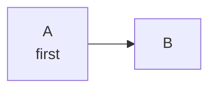

# Architecture Overview

See [core systems](#core-systems) and the [setup guide](../guides/setup.md#install).

## Core systems

- Collection
  - Nested item with [a link](../product/overview.md#ports-8080)
- Storage

| Component | Port |
| --- | --- |
| Collector | `:8082` |

## Core systems

A duplicate heading, which GitHub slugs as `core-systems-1`.
